# How to manually upgrade from v3.0 to v3.1 workflows

In case you have made custom changes to your inbound flows, you can manually upgrade your existing v3.0 flows to v3.1. This ensures that the custom changes are retained and don't have to be repeated. Follow the below steps for the same:

## For Template flows
- These changes apply only to media specific inbound flows.
- Open the flow you need to update.
- Create the following new custom variables:
    - `isMalwareValidationDone`
    - `isMalwareCompliance`
    - `malwareNonComplianceReasonObject`
    - `malwareScanDroppedAttachmentCount`
    - `isSecurityValidationDone`
    - `isSecurityCompliance`
    - `securityNonComplianceReasonObject`
    - `securityScanDroppedAttachmentCount`
    - 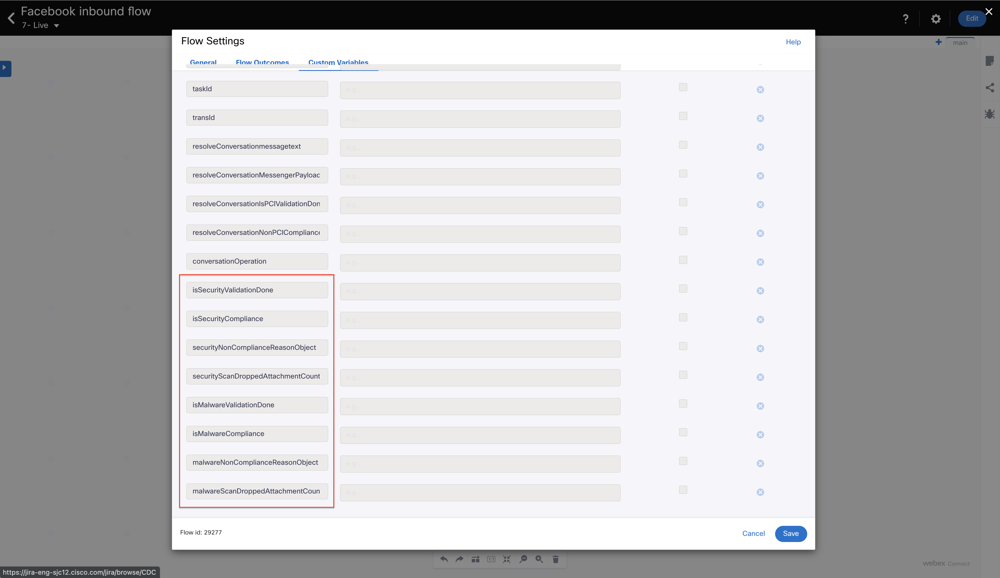
- Edit the first node to set the above newly created custom variables via the transition actions. The values for each of the variables can be obtained from the node output section.
  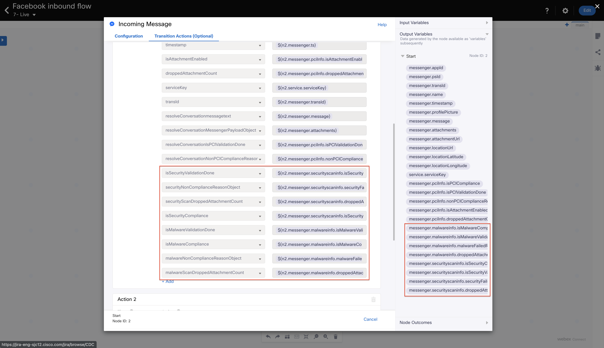
- Note that in SMS flows, `malwareScanDroppedAttachmentCount` and `securityScanDroppedAttachmentCount` need to be set to `0` in the previous step as the node's output variables do not contain these values for SMS.
  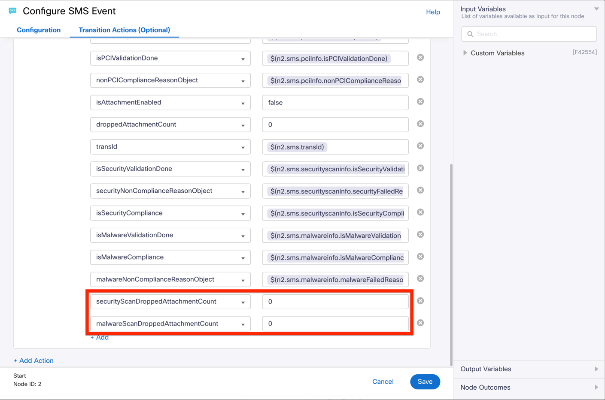
- Update the `Evaluate`/`Parse Variables` node with the below lines of code, adding the variables `malwareScanDetails` and `securityScanDetails` and replacing the existing variable `details`. No changes required to the `pci` variable.<br>
  <br>
  In version 3.0 (previous) for all channels except Email:
  ```
    var pci = {
      "isPCICompliant": JSON.parse(isPCICompliance.replace("NA", "true")),
      "isPCIValidationDone": resolveConversationIsPCIValidationDone,
      "nonPCIComplianceReason": resolveConversationNonPCIComplianceReasonObject,
      "droppedAttachmentCount": JSON.parse(droppedAttachmentCount.replace("NA", "0"))
    };
  
    var details = {
      "messageDetails": messageDetails,
      "pciDetails": pci
    };
  ```

  In version 3.1 (current) for all channels except Email:
  ```
    var pci = {
      "isPCICompliant": JSON.parse(isPCICompliance.replace("NA", "true")),
      "isPCIValidationDone": resolveConversationIsPCIValidationDone,
      "nonPCIComplianceReason": resolveConversationNonPCIComplianceReasonObject,
      "droppedAttachmentCount": JSON.parse(droppedAttachmentCount.replace("NA", "0"))
    };
  
    var malwareScanDetails = {
      "isMalwareCompliant": JSON.parse(isMalwareCompliance.replace("NA", "true")),
      "isMalwareValidationDone": isMalwareValidationDone,
      "malwareFailedReason": malwareNonComplianceReasonObject,
      "malwaredroppedAttachmentCount": JSON.parse(malwareScanDroppedAttachmentCount.replace("NA", "0"))
    };
  
    var securityScanDetails = {
      "isSecurityCompliant": JSON.parse(isSecurityCompliance.replace("NA", "true")),
      "isSecurityValidationDone": isSecurityValidationDone,
      "securityFailedReason": securityNonComplianceReasonObject,
      "securityScanDroppedAttachmentCount": JSON.parse(securityScanDroppedAttachmentCount.replace("NA", "0"))
    };
  
    var details = {
      "messageDetails": messageDetails,
      "pciDetails": pci,
      "malwareScanDetails": malwareScanDetails,
      "securityScanDetails": securityScanDetails
    };
  ```

  In version 3.0 (previous) for Email channel:
  ```
  var pci = JSON.stringify({
    "isPCICompliant": JSON.parse(isPCICompliance.replace("NA", "true")),
    "isPCIValidationDone": resolveConversationIsPCIValidationDone,
    "nonPCIComplianceReason": resolveConversationNonPCIComplianceReasonObject,
    "droppedAttachmentCount": JSON.parse(droppedAttachmentCount.replace("NA", "0"))
  });
  
  var details = "{\"messageDetails\":" + messageDetails +
    " , \"pciDetails\": " + pci 
  "}";
  ```
  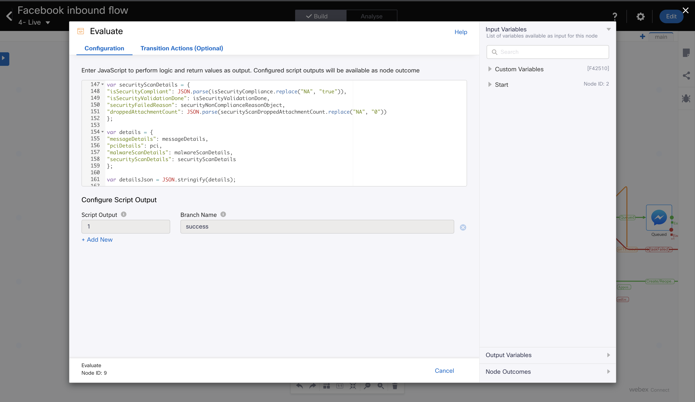

  In version 3.1 (current) for Email channel:
  ```
  var pci = JSON.stringify({
    "isPCICompliant": JSON.parse(isPCICompliance.replace("NA", "true")),
    "isPCIValidationDone": resolveConversationIsPCIValidationDone,
    "nonPCIComplianceReason": resolveConversationNonPCIComplianceReasonObject,
    "droppedAttachmentCount": JSON.parse(droppedAttachmentCount.replace("NA", "0"))
  });
  
  var malwareScanDetails = JSON.stringify({
    "isSecurityCompliant": JSON.parse(isMalwareCompliance.replace("NA", "true")),
    "isSecurityValidationDone": isMalwareValidationDone,
    "securityFailedReason": malwareNonComplianceReasonObject,
    "droppedAttachmentCount": JSON.parse(malwareScanDroppedAttachmentCount.replace("NA", "0"))
  });
  
  
  var securityScanDetails = JSON.stringify({
    "isSecurityCompliant": JSON.parse(isSecurityCompliance.replace("NA", "true")),
    "isSecurityValidationDone": isSecurityValidationDone,
    "securityFailedReason": securityNonComplianceReasonObject,
    "droppedAttachmentCount": JSON.parse(securityScanDroppedAttachmentCount.replace("NA", "0"))
  });
  
  var details = "{\"messageDetails\":" + messageDetails +
    " , \"pciDetails\": " + pci +
    " , \"malwareScanDetails\": " + malwareScanDetails +
    " , \"securityScanDetails\": " + securityScanDetails +
  "}";  
  ```
  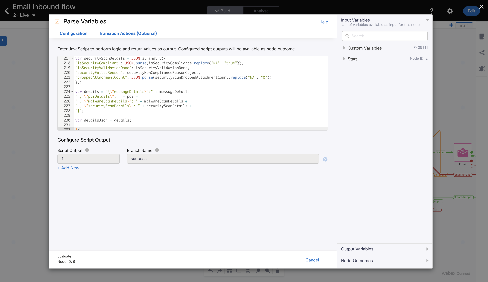

- Save your changes and make the flow live

## For flows with Receive and Append nodes
- These steps need to be followed if you have flows where you have a Receive node (waiting for the customer's message during the course of execution of the flow, and not the message that invokes the first node of the flow) followed by an Evaluate node and then an Append Conversation node.
  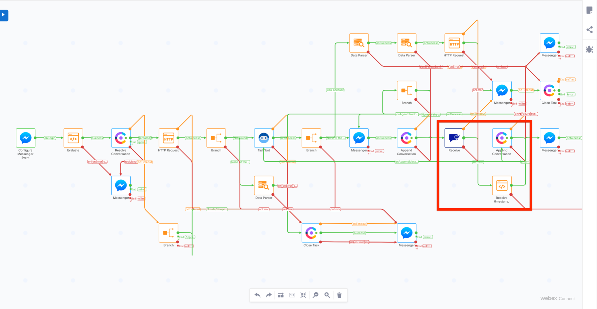
- This is to ensure that the message being sent as part of the Append Conversation request, is the one that has gone through the Security scan.
- In the Receive node's transition actions, replace the setting of PCI variables with setting of Security Scan variables as below:
  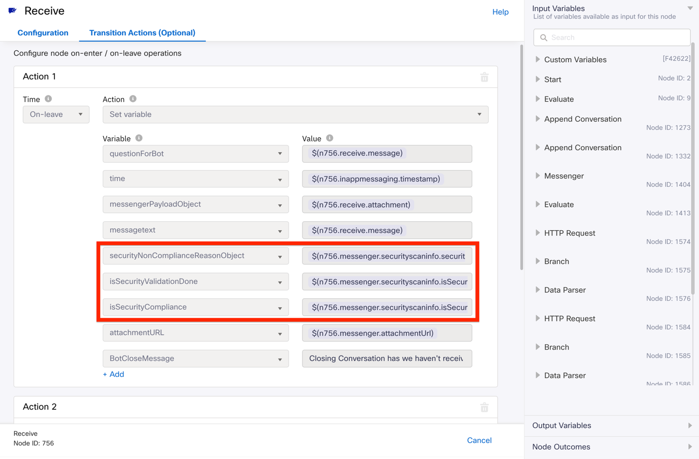
- | Currently used custom variable         | Custom variable to be used in its place     |
  | -------------------------------------- | ------------------------------------------- |
  | nonPCIComplianceReasonObject           | securityNonComplianceReasonObject           |
  | isPCIValidationDone                    | isSecurityValidationDone                    |
  | isPCICompliance                        | isSecurityCompliance                        |
  | droppedAttachmentCount                 | securityScanDroppedAttachmentCount          |
  | nonPCIComplianceReasonAttachmentObject | securityNonComplianceReasonAttachmentObject |
- In the Evaluate node following the Receive node as well, replace the PCI fields with the corresponding Security scan fields as mentioned in the table in the previous step.
  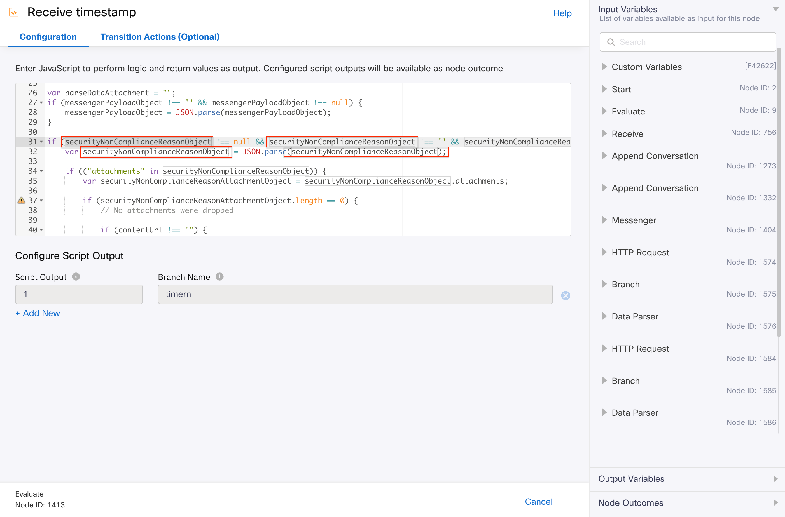
- Note: The above image is just for sample and the code in the Evaluate node varies from channel to channel.  
- Save your changes and make the flow live

## For supporting emails without sender name / subject 
- Create two new custom variables ```defaultSenderName``` and ```defaultSubject```, and set them to appropriate default values.
  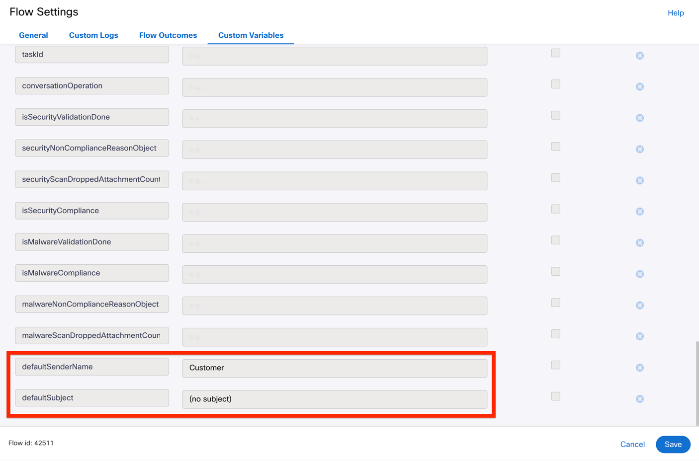
- Add the below lines of code to the Evaluate node just before constructing the ```messageDetails``` variable
- ```
  // Default senderName assignment
  if (!senderName || senderName.trim() === "") {
      senderName = defaultSenderName;
  }
  //Default Subject assignment
  if (!subject || subject.trim() === "") {
      subject = defaultSubject;
  }
  ```
- 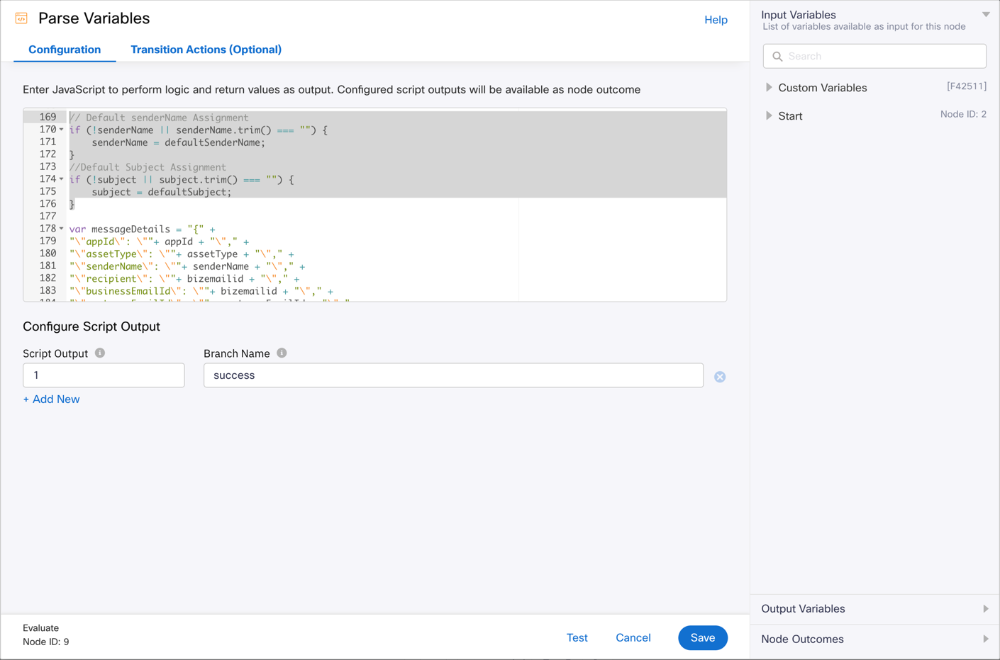
- Save your changes and make the flow live


## For supporting plain text emails
- In the Evaluate node, add the below lines of code where the handling of email message body occurs:
  ```
  if (messageHTML === "" || messageHTML == null || messageHTML == undefined) {
      messageHTML = "<p>" + messagetext + "</p>";
  }
  ```
  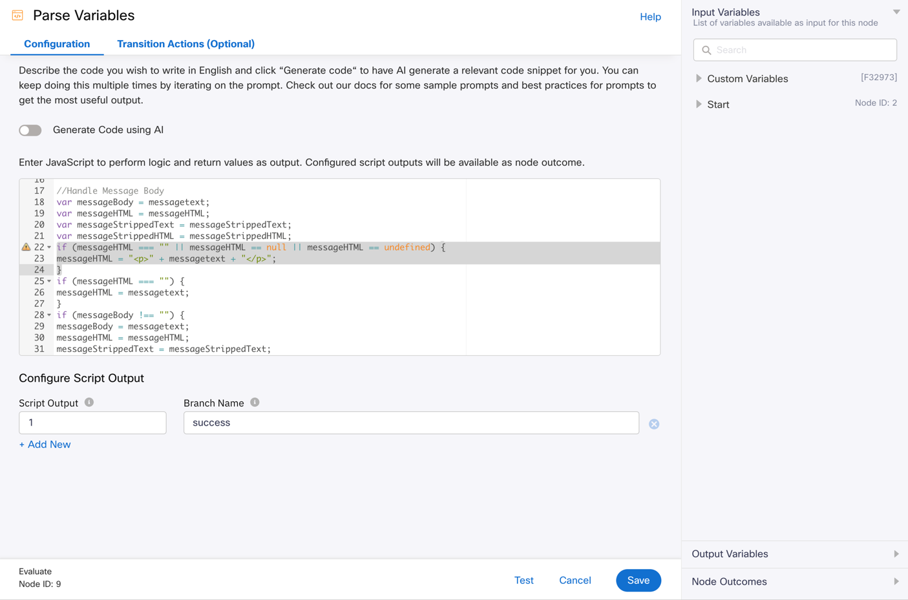
- In the ```messageDetails``` variable, update the line setting the ```htmlMessage``` variable as below:
  ```
  "\"htmlMessage\": \""+ messageHTML + "\"," +
  ``` 
  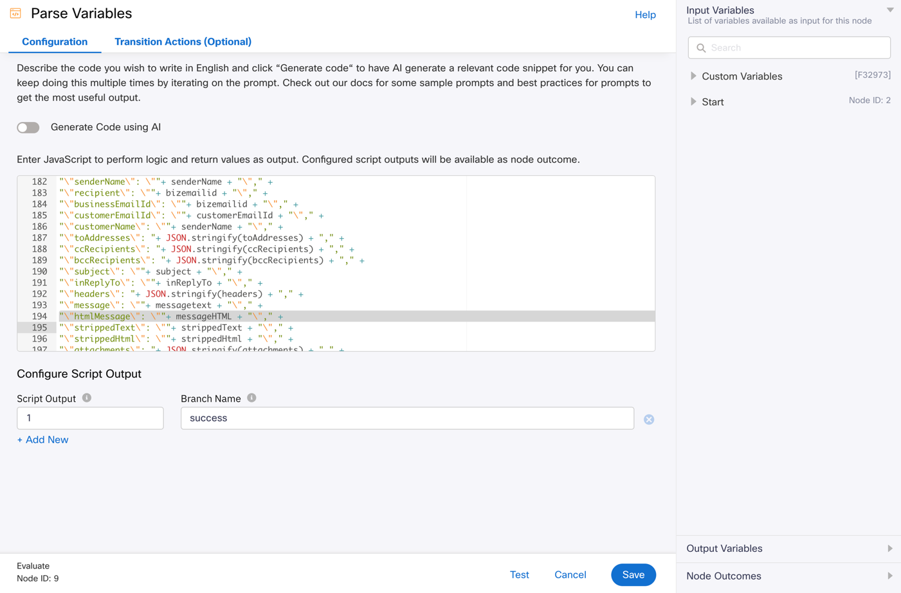
- Save your changes and make the flow live
