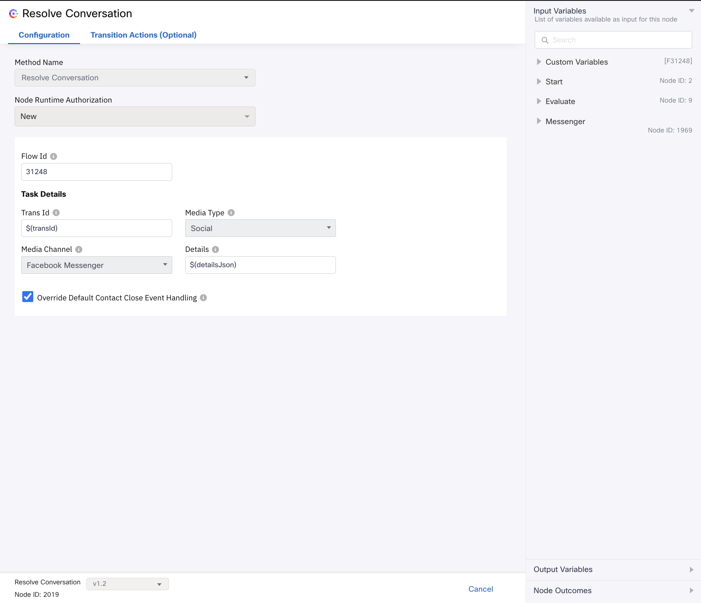

# How to manually upgrade from v3.1 to v3.2 workflows

In case you have made custom changes to your inbound flows, you can manually upgrade your existing v3.1 flows to v3.2. This ensures that the custom changes are retained and don't have to be repeated. Follow the below steps for the same:

## For Enabling Post Contact Surveys
- These changes apply only to media specific inbound flows.
- Open the flow you need to update.
- Open the Resolve Conversation node and upgrade it to the latest available version (v1.2), where you'll find a new checkbox "Override Default Contact Close Event Handling".
- Enable this checkbox and add a Task Close Flow if you intend to send survey messages or links to customers upon task closure.
- You can keep the checkbox disabled if you don't want to send survey messages or links to customers task closure.
- Sample task close flow is present in [Usage Of Survey in Flows](v3.2/Sample/Usage%20Of%20Surveys%20in%20Flows/).
- For more details refer to [Usage Of Survey in Flows Readme](v3.2/Sample/Usage%20Of%20Surveys%20in%20Flows/README.md).
- Ensure to re-enter all the information previously provided in the Resolve Conversation Node.

    

- If you incorporate the Resolve Conversation Node from the Integrations panel in Webex Connect node palette, make sure to enable the following checkbox, as illustrated in the screenshot below.

  

## For Setting Priority to Contacts
- Build custom logic to determine contact priority in the media specific inbound flows.
- Custom logic can be based on any field such as the email subject from incoming message, email ID from incoming message, SMS or Whatsapp phone number, chat form values, text message of the customer, etc.
- Any other custom field can also be used to build the logic. 
- Nodes like Evaluate, Branch or others from the node palette can be used to build the custom logic.
- Once the priority is determined for the contact, it can be set while queuing the contact to a queue, using the Queue Task node.
- Open the Queue Task node and upgrade it to the latest available version (v1.3), where you'll find a new field "Contact Priority".
- Set the contact priority in the "Contact Priority" field if you want to prioritize the contact in the queue, otherwise it can be left empty.

    

- Sample flow is present in [Usage Of Contact Priority in Flows](v3.2/Sample/Usage%20of%20Contact%20Priority%20In%20Flows/).
- For more details refer to [Usage Of Contact Priority in Flows Readme](v3.2/Sample/Usage%20of%20Contact%20Priority%20In%20Flows/README.md).
