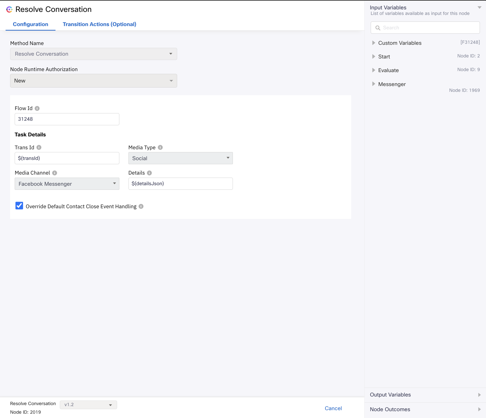
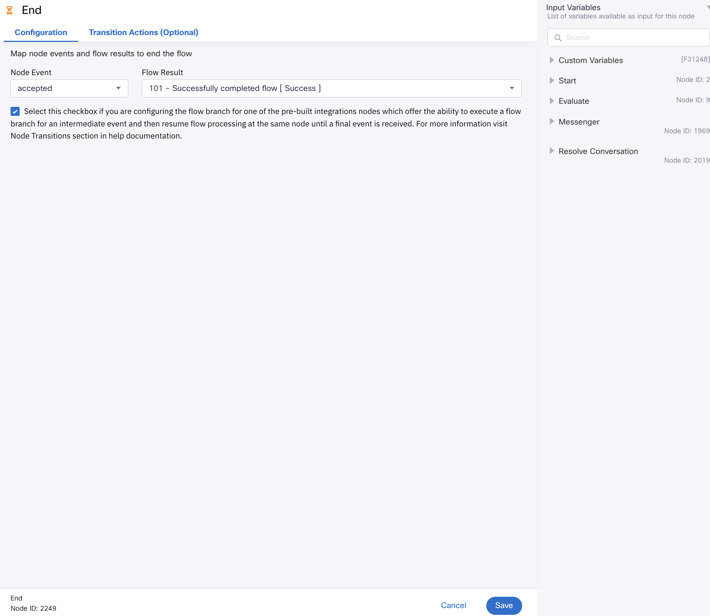

# How to manually upgrade from v3.2 to v3.3 workflows

In case you have made custom changes to your inbound flows, you can manually upgrade your existing v3.2 flows to v3.3. This ensures that the custom changes are retained and don't have to be repeated. Follow the below steps for the same:

## For all flows
- Upgrade the below nodes to the latest versions in all existing flows:
  - Search Conversation
  - Append Conversation

## For Enabling Post Contact Surveys
- These changes apply only to media specific inbound flows.
- Open the flow you need to update.
- Open the Resolve Conversation node and upgrade it to the latest available version (v1.2), where you'll find a new checkbox "Override Default Contact Close Event Handling".
- Enable this checkbox and add a Task Close Flow if you intend to send survey messages or links to customers upon task closure.
- You can keep the checkbox disabled if you don't want to send survey messages or links to customers task closure.
- Sample task close flow is present in [Usage Of Survey in Flows](v3.3/Sample/Usage%20Of%20Surveys%20in%20Flows/).
- For more details refer to [Usage Of Survey in Flows Readme](v3.3/Sample/Usage%20Of%20Surveys%20in%20Flows/README.md).
- Ensure to re-enter all the information previously provided in the Resolve Conversation Node.

    

- If you incorporate the Resolve Conversation Node from the Integrations panel in Webex Connect node palette, make sure to enable the following checkbox, as illustrated in the screenshot below.

    

