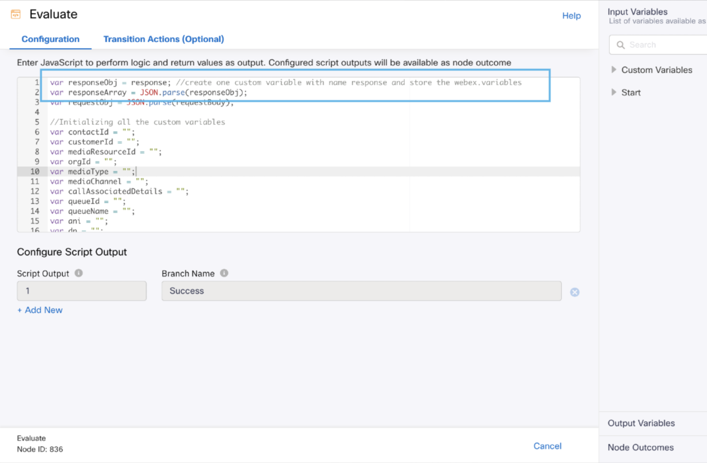
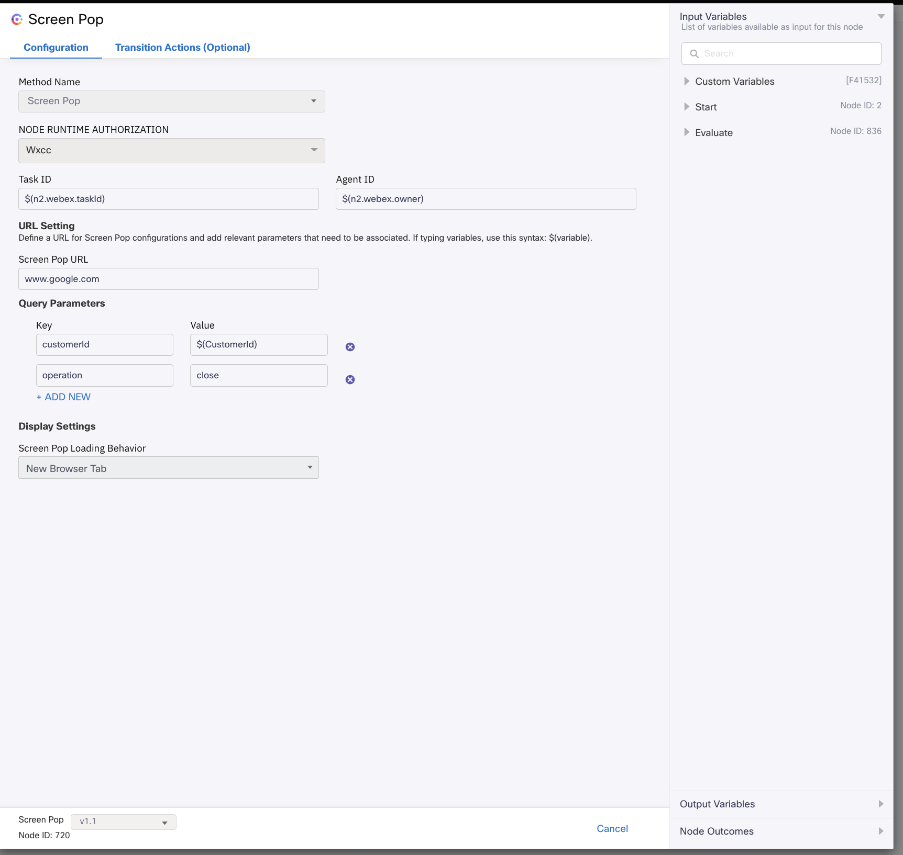
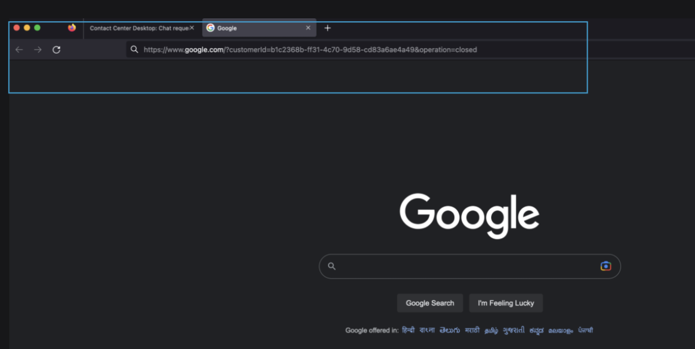
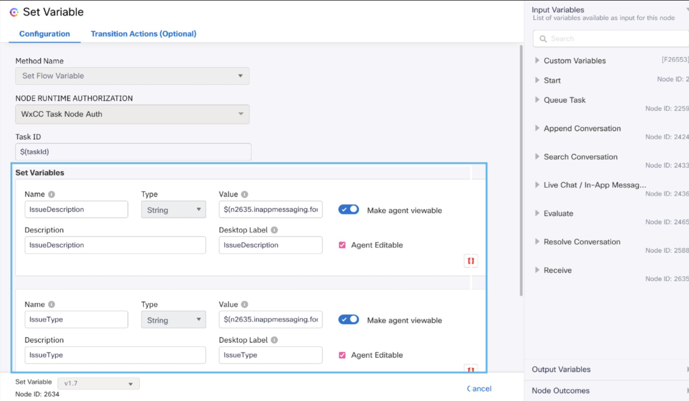

# Screen Pop Sample Flows Overview :
- Screen Pop feature allows you to trigger screen pop based on various parameters of the ongoing conversation.
- In Screen Pop node, you need to define a URL and query parameters that will be passed as query string to WxCC agent desktop and opened as screen pop.
- This example demonstrates the usage of Screen Pop node using Task Close Flow. However, any "Event Handling Workflows" can use Screen Pop. It can't be used in the media specific workflows.
- For more details, refer to - https://help.imiconnect.io/docs/screen-pop

# Screen Pop Node:
- Screen Pop node consists of the following configuration fields
  - Screen Pop Url
  - Query Parameters
  - Display Settings that will define the loading behaviour of screen pop such as Screen Pop can be loaded inside WxCC agent desktop in the same browser tab, or in the
    new browser tab.
  
This folder includes the following sample flow for Screen Pop :
## Task Close Flow with Screen Pop 
- This sample flow will send a screen pop message to the agent desktop on Webex Contact Center once the contact is closed. Though screen pop is not limited to task close flow.
It can be used in any event handling workflow.

## Setting up the flow with a screen pop.

There are two ways to use variables for a screen pop.
1. We can use the existing system defined variables.
- We have assigned webex.variables to response in the 'Transition Actions' section of the start node.

  

- We can extract the customerId in the evaluate node.

  

  

- In the screen pop node for query params we are using the extracted customerId from the previous step and operation we have hardcoded to close.
- We are setting url as www.google.com in the sample as shown so this screenpop will redirect the agent to the particular url.

    

  - Example of Screen Pop message presented to the agent:-
  - In this example we can see the url is set to "www.google.com" and query params like customerId and operation is set to the correct values.

    

2. We can use the set variable node in the main flow to set the variables.

    

- We can extract these variables in the task close flow in the evaluate node using the extract helper function.
 
    
  

- We can utilize these extracted variables in the screen pop node.
- We can fill the url to which the agent must be navigated. 
 
    

