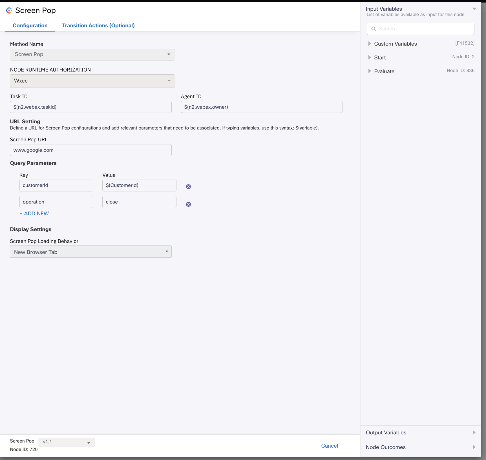
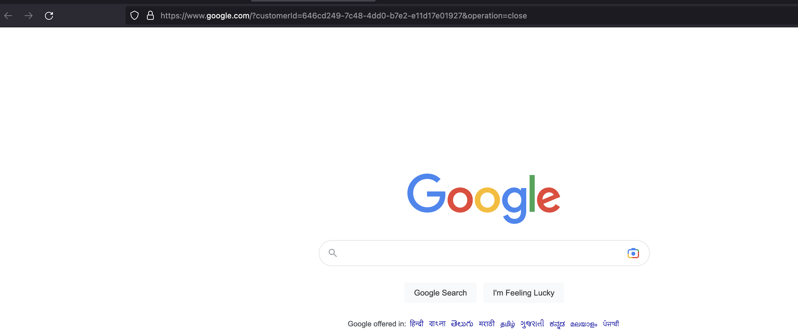

# Screen Pop Sample Flows Overview :
- Screen Pop feature allows you to trigger screen pop based on various parameters of the ongoing conversation.
- In Screen Pop node, you need to define a URL and query parameters that will be passed as query string to a third party application and opened as screen pop.
- This example demonstrates the usage of Screen Pop node using Task Close Flow. However, any workflow can use the Screen Pop node.
- For more details, refer to - https://help.imiconnect.io/docs/screen-pop

The folder includes the following sample flow for Screen Pop :
## Task Close Flow with Screen Pop 
- This flow will send a screen pop message to the agent desktop on Webex Contact Center once the contact is closed.
- Screen Pop node consists of the following configuration fields
  - Screen Pop Url
  - Query Parameters
  - Display Settings that will define the loading behaviour of screen pop such as Screen Pop can be loaded inside desktop in the same browser tab, or in the
    new browser tab.
  - Example of Screen Pop Node:-

  
  

  - Example of Screen Pop message presented to the agent:-
  

  