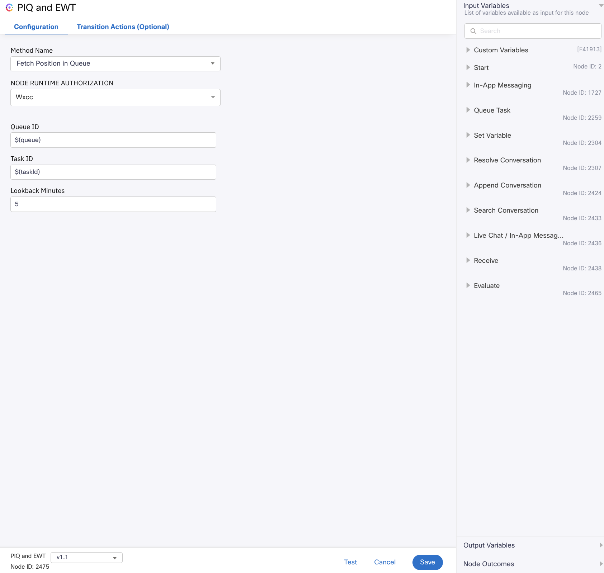
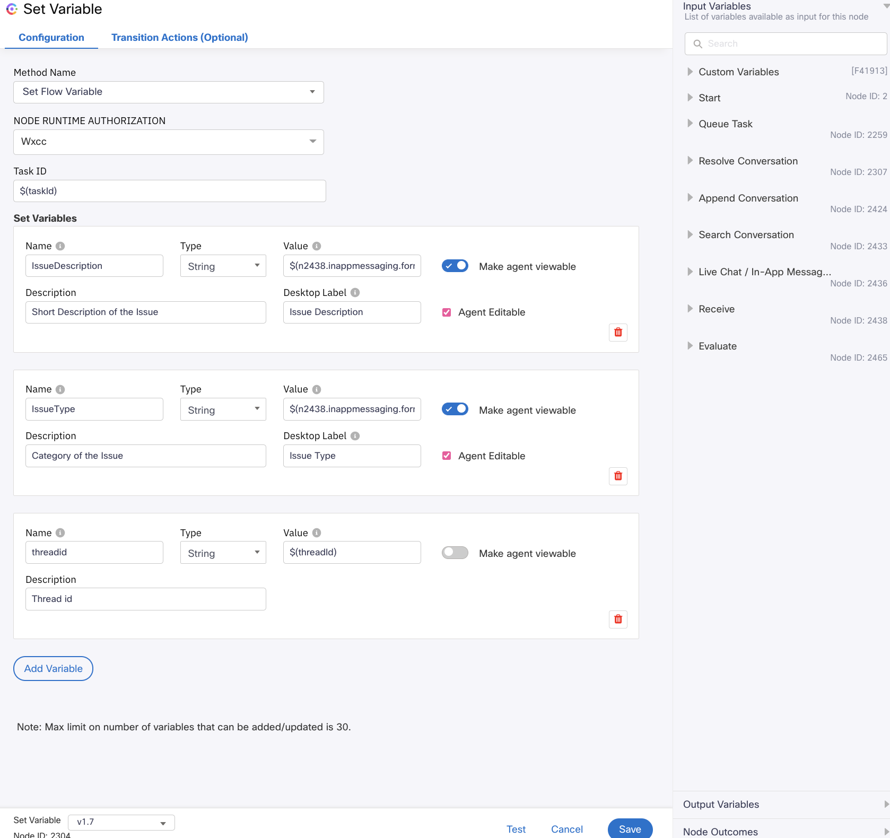

# Set Variable, PIQ And EWT Sample Flows Overview :
- This example demonstrates the usage of Set Variable node, PIQ and EWT node using Live Chat Flow and Task Route Flow. However, the use case is not limited to the livechat only. Any workflow can use the Set Variable node, PIQ and EWT node.
## PIQ and EWT
- Position in the Queue (PIQ) provides the contact's current position in the selected queue.
- Estimated Wait Time (EWT) provides an estimated waiting time or the average wait time for the contact before talking to an agent.
- PIQ and EWT node can be placed only after the Queue Task node.
- For more details on PIQ and EWT please refer to the below documentation.
- https://help.imiconnect.io/docs/piq-and-ewt
- Example of PIQ and EWT node.
- 

## Set Variable
- The example uses fields from a pre-chat form to inject into the system, however Set Variable Node can inject any variable into the system.
- For more details on Set Variable please refer to https://help.imiconnect.io/docs/set-variable. 
- Example of Set Variable node.
- 

The folder includes the following sample flows :
## Media Specific Workflow :
- ### Live Chat Inbound Sample Flow with Set Variable, PIQ and EWT :
    - Every inbound customer message sent over the configured customer chat widget will trigger this workflow.
    - This workflow represents a typical use case for a bank, where a customer reaches out to customer support executives for issues with credit cards, debit cards, savings accounts, or loan enquiry.
    - The customer selects the issue type from the pre-chat form dropdown.
    - The customer can also provide a short description of the issue.
    - These additional contextual details about the interaction are injected into the contact centre using the "Set Variable" Node. The sample flow gives an example of how to do that using the "Set Flow Variable" method in the "Set Variable" Node.
    - The Agent can view the injected details in the interaction panel of Agent Desktop.
## Media Agnostic Event Workflow :
- ### Task Routed Workflow :
    - The contextual information injected from the media-specific workflows is also available to the shared flow.
    - An "Evaluate" node can extract these details. The sample flow gives an example of how to do that.

## Quick Start on Workflows
1. Import the flows in your Webex Connect Service.
2. Create a chat widget template like the one shown in this picture.
   Use this template in the Form Template field in the Pre-chat form and Receive Node.
3. Select the appropriate queue in the "Queue Task" node for the channel.
4. Make the flow live with the configured asset.

## Note
- The sample flow uses Set Flow Variable method in Set Variable node to inject the variables. The variables can also be injected into the system using Set Global Variable method.
- For using Set Global Variable method:
  - Create a Global Variable on Webex Contact Center Management Portal and save it.
  - In Set Variable Node with the method name Set Global Variable, select that variable and set a value. 