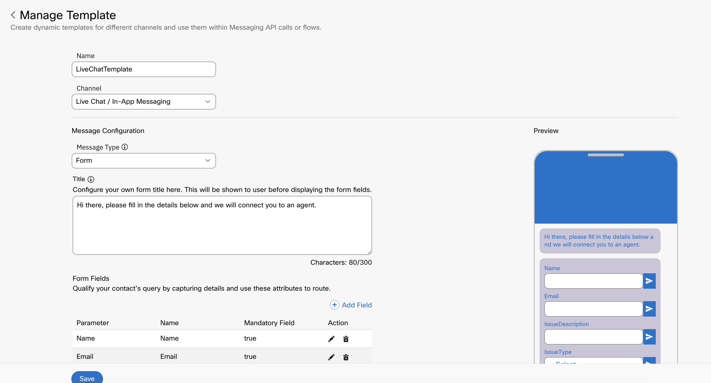
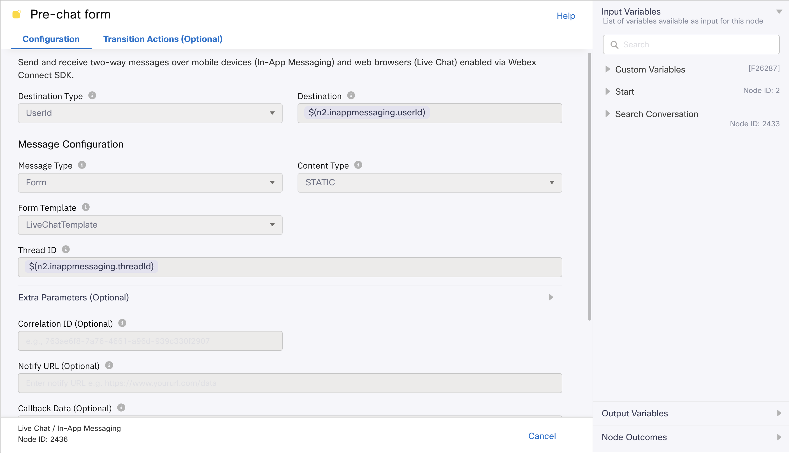

# Media Specific Workflows

## Workflows Overview
The following workflow templates are included :

**Media Specific Workflows** : These flows need to be imported once per asset of the specific channel.
* **Facebook Inbound Flow** - This workflow will be triggered for every inbound customer message over the integrated Facebook page.
* **Live Chat Inbound Flow** - This workflow will be triggered for every inbound customer message over the configured customer chat widget, and the widget has a live chat form configured.
* **Live Chat Inbound Flow Without Form** - This workflow will be triggered for every inbound customer message over the configured customer chat widget and the widget doesn't have a live chat form configured.
* **SMS Inbound Flow** - This workflow will be triggered for every inbound customer sms sent over the integrated SMS phone number.
* **Email Inbound Flow** - This workflow will be triggered for every inbound customer email to the integrated email account.
* **Whatsapp Inbound Flow** - This workflow will be triggered for every inbound customer message over the integrated whatsapp business number.
* **Live Chat Close Flow** - This workflow will be triggered when a livechat customer has ended the chat.

Note : 
- Queue selection from queue task node is mandatory for any channel flows before making the flow live.
- Flow variables must be updated in the setting section with the correct asset details before making the flow live.

## Updating Flow Variables

Flow Variables that need to be updated under Custom Variables for different channels: -
- LiveChat :- appId and liveChatDomain

    

- Facebook :- FBpageid and appid

    
  
- Whatsapp :- WANumber and appid

    

- Email    :- bizemailid

    

### Live Chat Inbound Flow Details
- In the Live Chat Flow, we need to select the template. For creation of template refer to https://help.imiconnect.io/docs/livechat-template
Sample template is shown in below image

    

- In the Live Chat/In App messaging node we have selected the message type as form and we have to choose the template from the dropdown which has the list of all the livechat templates available in that tenant

    

- In this sample we have filled the template as LiveChatTemplate(the sample one shown in above image)

    

- In the Receive node transition action we need to set the variable customerName and customerEmail and this customerName and customerEmail will 
be visible on the agent desktop.

- We are getting the value for customerName and customerEmail from the livechat form. 
- The value of customerName and customerEmail will be extracted from Live Chat form response. In the sample Live Chat template, "Name" and "Email" fields are configured. Hence, `$(n2438.inappmessaging.formFields.Name)`
  and `$(n2438.inappmessaging.formFields.Email)` and configured as values for customerName and customerEmail variables respectively.
  Based on your form fields, the value for the above variables will change, however; the variable names i.e customerName and customerEmail must remain intact. 
- For instance, if the form fields are named as UserName and UserEmail, the customerName and customerEmail variables must be set as `$(n2438.inappmessaging.formFields.UserName)` and
  `$(n2438.inappmessaging.formFields.UserEmail)` in the Receive node Transition Actions.

    

### Live Chat Close Flow Details
- This flow is invoked when the live chat customer chooses to close the conversation by clicking on the "End chat" button in the chat widget.
    
- AliasId is taken in from the Search Conversation response and passed on to the Close Task node as the task identifier, to terminate the task in the backend.
    

## How to setup Workflows?

* Follow the process for Organization setup in WxCC with IMI Integration.
* Download the sample flow template from the repository.
* Import the flows in your Webex Connect service.
* Add authorizations at integration level.
* For Resolve Conversation node flow id needs to be updated manually. Flow id can be obtained from the address bar. For example flow id (41896) can be obtained from the url https://testorg.datacenter.webexconnect.io/flowdesigner/flow/v3/flowView?flowId=41896
* Modify the flows as per your use case.
* Make flows live with the configured assets.

Details of this material is available in Webex Connect platform documentation.
* Login to your Webex Connect account.
* Click `Documentation` under `Help` section.
* Click on `Documentation` under `Help` section.
* Webex Connect platform documentation will open in a new tab.
* Webex Connect platform documentation will open in a new tab.
* Under `Getting Started`, click `Webex Connect Platform Overview`.
* Under `GETTING STARTED` click on `Webex Connect Platform Overview`.
* Scroll down to the `Webex Contact Center and Webex Connect Integration` section.
* Scroll down to `CISCO WEBEX CONTACT CENTER AND Webex CONNECT INTEGRATION` section.
* Click `Overview`.
