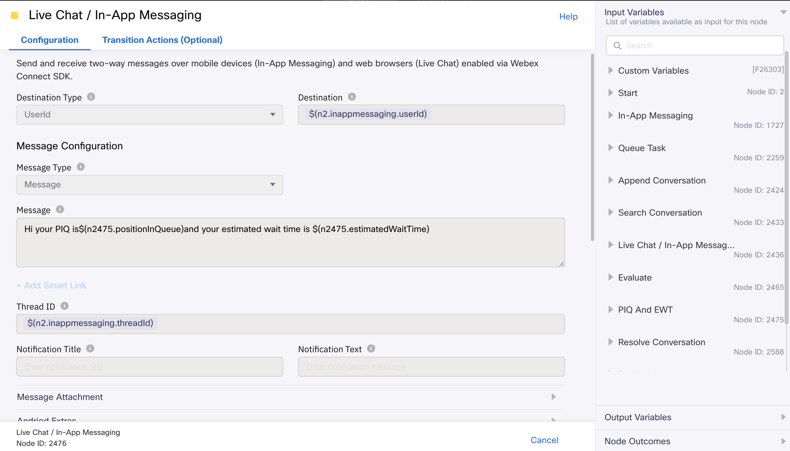
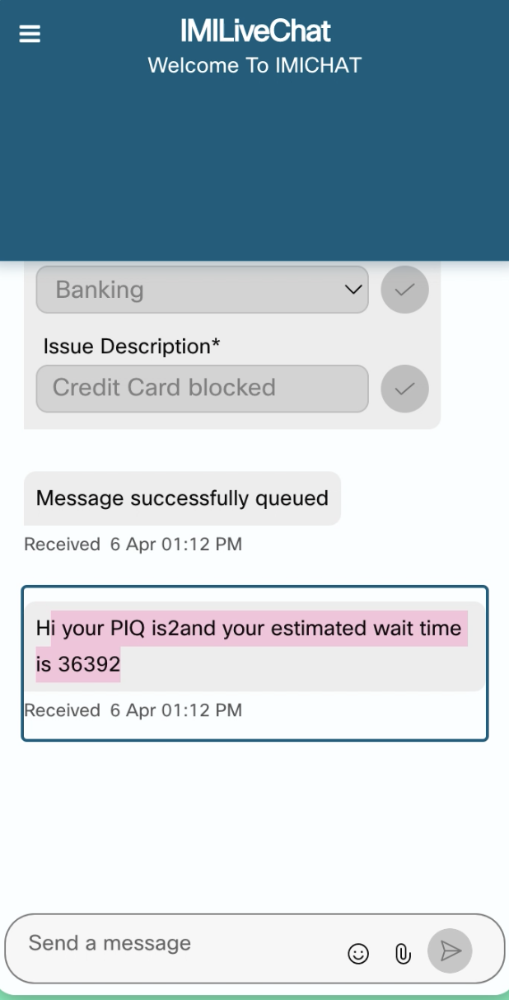

# PIQ And EWT Sample Flows Overview :
- This example demonstrates the usage of PIQ and EWT node using Live Chat Flow. However, the use case is not limited to the livechat only. Any workflow can use the PIQ and EWT node.
## PIQ and EWT
- Position in the Queue (PIQ) provides the contact's current position in the selected queue. PIQ provides an integer value that represents the position of contact in queue.
- Estimated Wait Time (EWT) provides an estimated waiting time or the average wait time for the contact before talking to an agent. EWT provides a value in milliseconds that represents the estimated waiting time in milliseconds. 
- PIQ and EWT node can be placed only after the Queue Task node.
- For more details on PIQ and EWT please refer to the below documentation.
- https://help.imiconnect.io/docs/piq-and-ewt

This folder includes the following sample flow :

- ### Live Chat Inbound Sample Flow with PIQ and EWT :
    - Every inbound customer message sent over the configured customer chat widget will trigger this workflow.
    - This workflow represents a typical use case for a bank, where a customer reaches out to customer support executives for issues with credit cards, debit cards, savings accounts, or loan enquiry.
    - The customer selects the issue type from the pre-chat form dropdown.
    - The customer can also provide a short description of the issue.

## PIQ and EWT Node
- We can place this node anywhere after Queue Task node in the media specific flows.
- The method name for PIQ and EWT node is Fetch Position in Queue.
- In the QueueID we have filled $(queue). The variable queueId gets populated with queue in the connect backend.
- If there are no contacts in the queue and the customer contact is directly assigned to the agent then the customer will get piq as -1.
- If you don't want to show piq value as -1 then you can add a branch to check if the value is not -1 then show the value of piq otherwise don't display piq.

    

- In the sample we are sending the message as 'Hi your PIQ is `$(n2475.positionInQueue)` and your estimated wait time is `$(n2475.estimatedWaitTime)` so `$(n2475.positionInQueue)` and `$(n2475.estimatedWaitTime)`
  will be replaced to the position in queue of the contact and estimated waiting time.

    
  
- Example of the piq and ewt presented to the customer on the live chat widget.

    

- In the given example piq of the contact is 2 and estimated waiting time is 36392 milliseconds.
