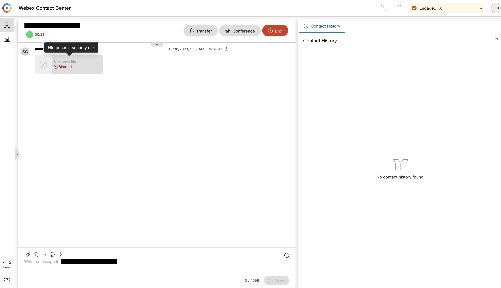
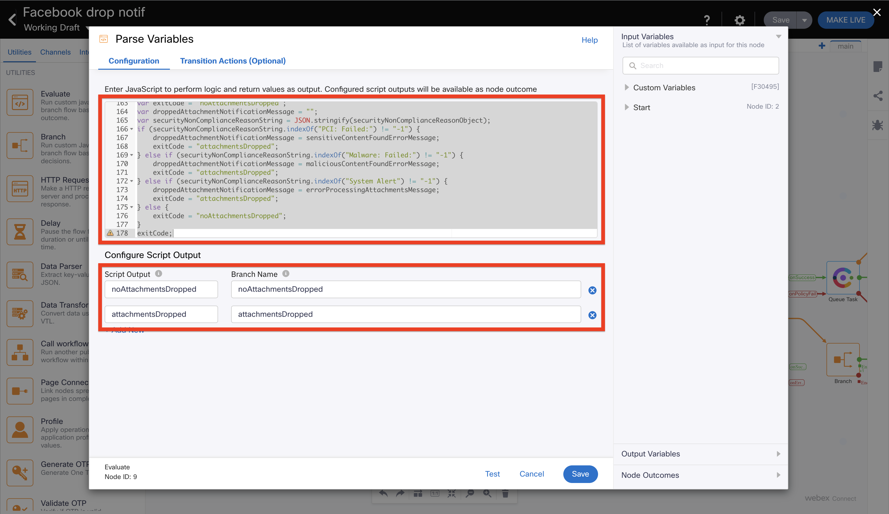
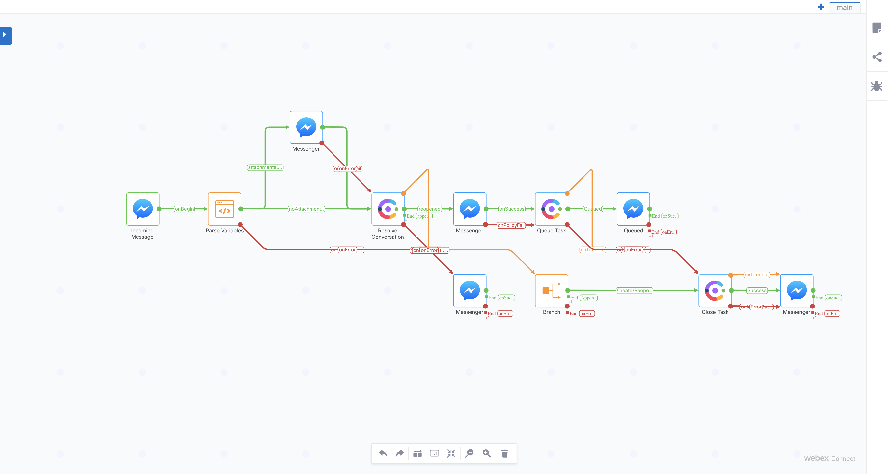
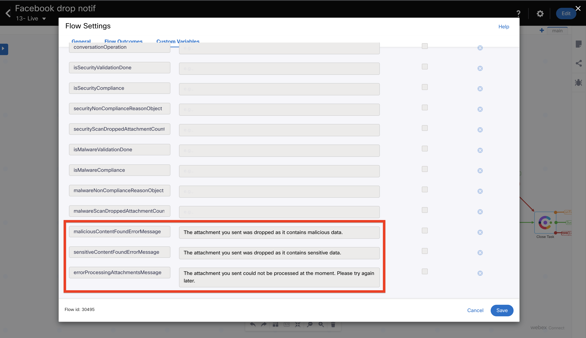
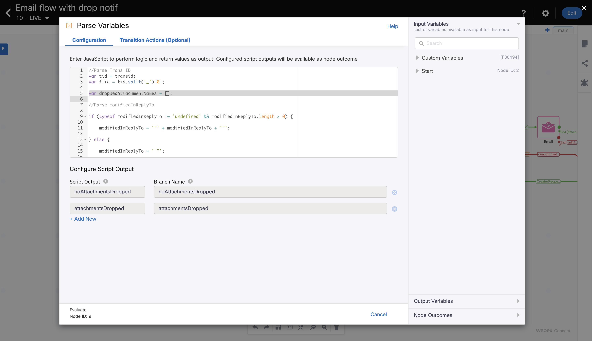
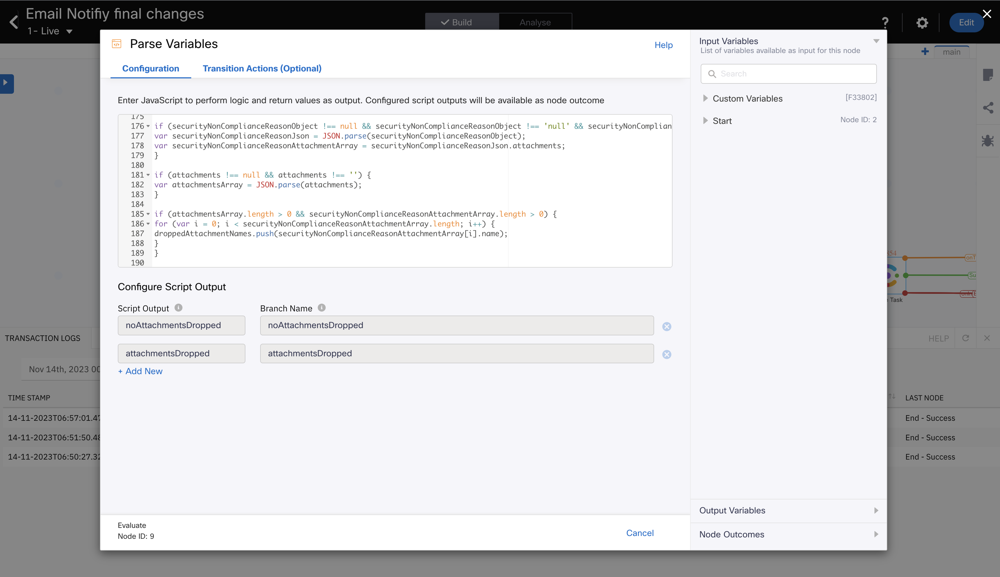
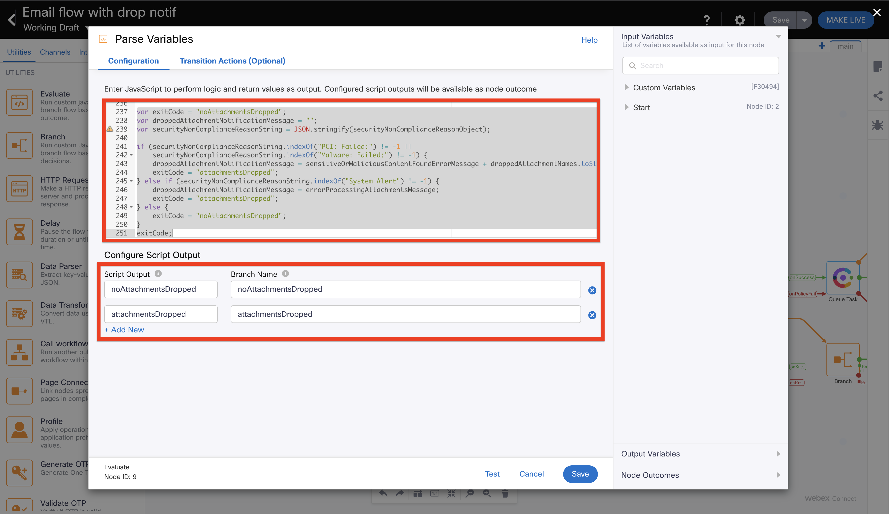

# Overview of sample flow to notify the customer about dropped attachments

- When a customer sends an attachment to the contact center, it may get dropped if it has unsupported, sensitive or malicious content.
- By default, the customer is not notified when the attachments are dropped; only the agent is made aware of it.
  
- If the flow admin wants to notify the customer as well, they can design their inbound flows in a way similar to this sample flow.
- This flow also informs the customer about the reason why the attachment was dropped ( sensitive content / malicious content / internal error).
- Steps are also outlined as to how to incorporate these changes into existing flows.

## Setting up the Social and Chat flows to notify the customer

- The logic outlined below can be followed for Facebook, Whatsapp, and Livechat channel flows.
- Edit the `Parse Variables` node to add these lines of code at the end of the script:
  ```
    var exitCode = "noAttachmentsDropped";
    var droppedAttachmentNotificationMessage = "";
  
    var securityNonComplianceReasonString = JSON.stringify(securityNonComplianceReasonObject);
  
    if (securityNonComplianceReasonString.indexOf("PCI: Failed:") != "-1") {
        droppedAttachmentNotificationMessage = sensitiveContentFoundErrorMessage;
        exitCode = "attachmentsDropped";
    } else if (securityNonComplianceReasonString.indexOf("Malware: Failed:") != "-1") {
        droppedAttachmentNotificationMessage = maliciousContentFoundErrorMessage;
        exitCode = "attachmentsDropped";
    } else if (securityNonComplianceReasonString.indexOf("System Alert") != "-1") {
        droppedAttachmentNotificationMessage = errorProcessingAttachmentsMessage;
        exitCode = "attachmentsDropped";
    } else {
        exitCode = "noAttachmentsDropped";
    }
  
    exitCode;
  ```
  
- Create 2 branches for the `Parse Variables` node output:
  - noAttachmentsDropped -> noAttachmentsDropped
  - attachmentsDropped -> attachmentsDropped
- Connect the `attachmentsDropped` branch of the `Parse Variables` node to a separate Messenger node to send out the notification to the customer.
  
- The message to be sent out can be configured via flow level custom variables. Currently, they have been assigned the below default values:
  - `sensitiveContentFoundErrorMessage` -> "The attachment you sent was dropped as it contains sensitive data." (Used when there is a PCI scan failure)
  - `maliciousContentFoundErrorMessage` -> "The attachment you sent was dropped as it contains malicious data." (Used when there is a Malware scan failure)
  - `errorProcessingAttachmentsMessage` -> "The attachment you sent could not be processed at the moment. Please try again later." (Used when there is an error while scanning / uploading the attachments)
- The above custom variables can be modified by the flow admin as per their choice.
  
- Connect all edges (success and failure) of the messenger nodes back to the resolve conversation node for further processing.
- Save your changes and make the flow live.

## Setting up the Email flow to notify the customer
- The logic outlined below is for Email channel flows only.
- Edit the `Parse Variables` node:
  - Create a new variable "droppedAttachmentNames" 
    
    ```
        var droppedAttachmentNames = []
    ```
  - Capture the names of dropped attachments by adding these lines to the script after defining `messageDetails` (for further reference as to the location of these lines, refer to the sample flow's `Parse Variables` node)
  
    ```
    if (securityNonComplianceReasonObject !== null && securityNonComplianceReasonObject !== 'null' && securityNonComplianceReasonObject !== 'NA') {
        var securityNonComplianceReasonJson = JSON.parse(securityNonComplianceReasonObject);
        var securityNonComplianceReasonAttachmentArray = securityNonComplianceReasonJson.attachments;
    }

    if (attachments !== null && attachments !== '') {
        var attachmentsArray = JSON.parse(attachments);
    }

    if (attachmentsArray.length > 0 && securityNonComplianceReasonAttachmentArray.length > 0) {
        for (var i = 0; i < securityNonComplianceReasonAttachmentArray.length; i++) {
            droppedAttachmentNames.push(securityNonComplianceReasonAttachmentArray[i].name);
        }
    }
    ```
  - Add these lines of code at the end of the script:
    
    ```
      var exitCode = "noAttachmentsDropped";
      var droppedAttachmentNotificationMessage = "";
    
      var securityNonComplianceReasonString = JSON.stringify(securityNonComplianceReasonObject);
  
      if (securityNonComplianceReasonString.indexOf("PCI: Failed:") != -1 || securityNonComplianceReasonString.indexOf("Malware: Failed:") != -1) {
          droppedAttachmentNotificationMessage = sensitiveOrMaliciousContentFoundErrorMessage + droppedAttachmentNames.toString();
          exitCode = "attachmentsDropped";
      } else if (securityNonComplianceReasonString.indexOf("System Alert") != -1) {
          droppedAttachmentNotificationMessage = errorProcessingAttachmentsMessage;
          exitCode = "attachmentsDropped";
      } else {
          exitCode = "noAttachmentsDropped";
      }
      exitCode;
    ```
- Create 2 branches for the `Parse Variables` node output:
    - noAttachmentsDropped -> noAttachmentsDropped
    - attachmentsDropped -> attachmentsDropped
- Connect the `attachmentsDropped` branch of the `Parse Variables` node to a separate Email node to send out the notification to the customer.
- The message to be sent out can be configured via flow level custom variables. Currently, they have been assigned the below default values:
    - `sensitiveOrMaliciousContentFoundErrorMessage` -> "The following attachments you sent were dropped as they contain sensitive/malicious data: [$(droppedAttachmentNames)]" (Used when there is a PCI scan failure or Malware scan failure)
      - Here, the [$(droppedAttachmentNames)] gets replaced with the list of the names of the dropped attachments.
    - `errorProcessingAttachmentsMessage` -> "The attachment(s) you sent could not be processed at the moment. Please try again later." (Used when there is an error while processing the attachments)
- The above custom variables can be modified by the flow admin as per their choice.
- Connect all edges (success and failure) of the Email node back to the resolve conversation node for further processing.
- Save your changes and make the flow live.
