# Survey Sample Flows Overview :
- This flow demonstrates the usage of WXM node using FacebookTaskCloseFlow and LiveChatTaskCloseFlow.
- When a flow administrator needs to send survey messages or survey links to customers, these flows can be utilized.

## Setting up the flow with a Wxm node.

### Pre-requisites

- Ensure that the 'override default contact close event handling' checkbox is enabled in the resolve conversation node of the main flow.

- This configuration applies to all media-specific inbound flows. For example, we have provided Facebook and LiveChat flows.

#### Facebook Flow

You must configure the facebook main flow's resolve conversation node with "override default contact close event handling" checkbox being checked.

 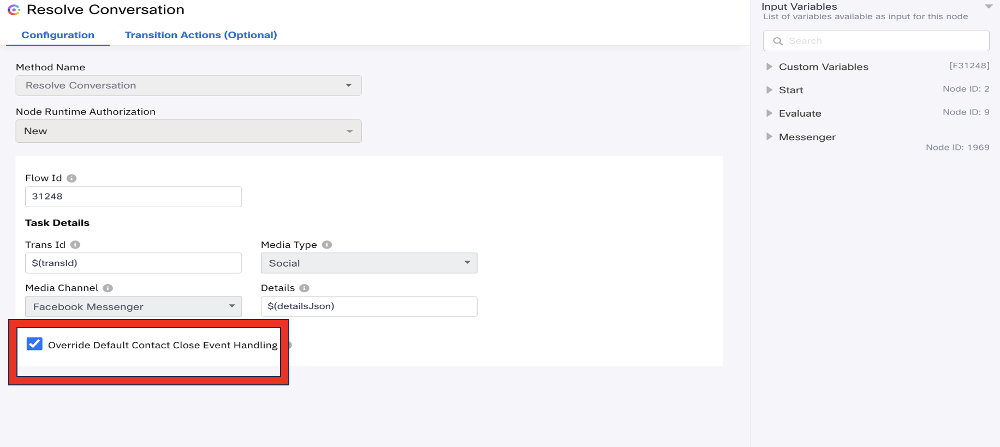 

#### Livechat Flow

1. You must configure the livechat main flow's resolve conversation node with "override default contact close event handling" checkbox being checked.

 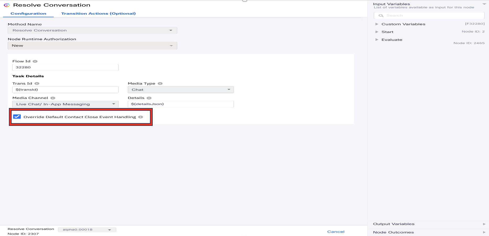 

2. In the livechat main flow add the set variable node to set threadId and userId

 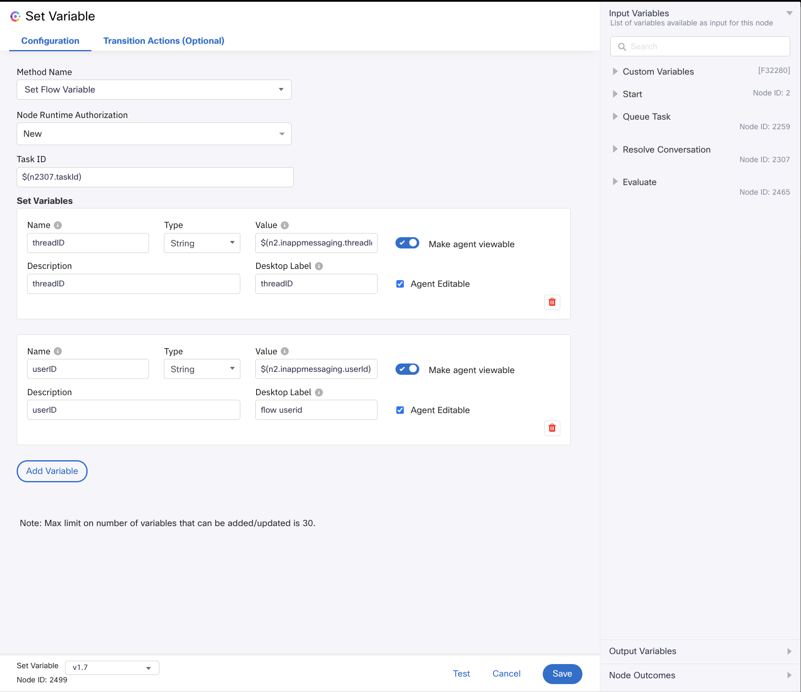 

### Setting up the WXM Node

 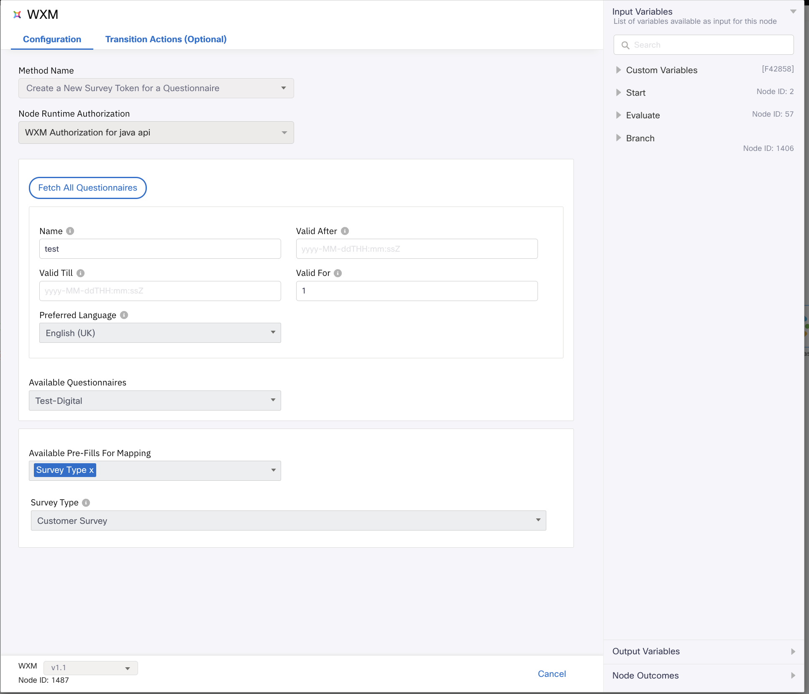 

1. Select the Method Name as Create a New Survey Token for a Questionnaire.
2. Select the necessary Node Runtime Authorization from the dropdown.
3. Click "Fetch All Questionnaires" to retrieve the list of questionnaires.
4. From the "Fetch All Questionnaires" pane, choose the specific questionnaires.
5. Specify the name. 
6. Specify the valid for.

- For more details on Wxm please refer to the below documentation.
- https://help.webex.com/en-us/article/nlu4x20/Experience-Management---Interactive-Voice-Response-Surveys-for-Webex-ContactCenter#survey-builder
- https://help.imiconnect.io/docs/experience-management

### Facebook Close Flow With WXM Node

 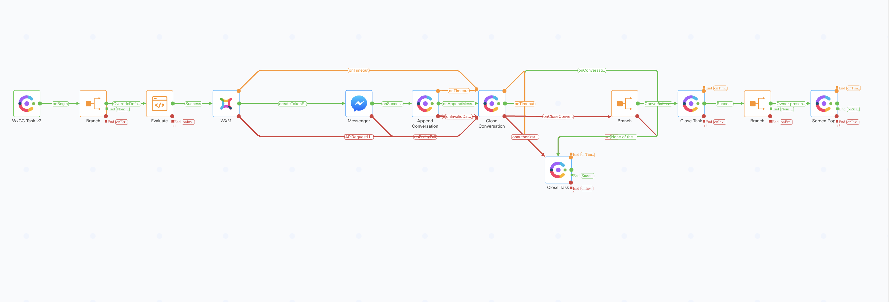 

- This flow allows the flow admin to send the survey messages and survey links to the customer over messenger once the agent wraps up the conversation.

-  Set up the Wxm node. 
-  In the messenger node,provide survey message and pick the survey link from the previous node as `$(n1487.surveyURL)`.

 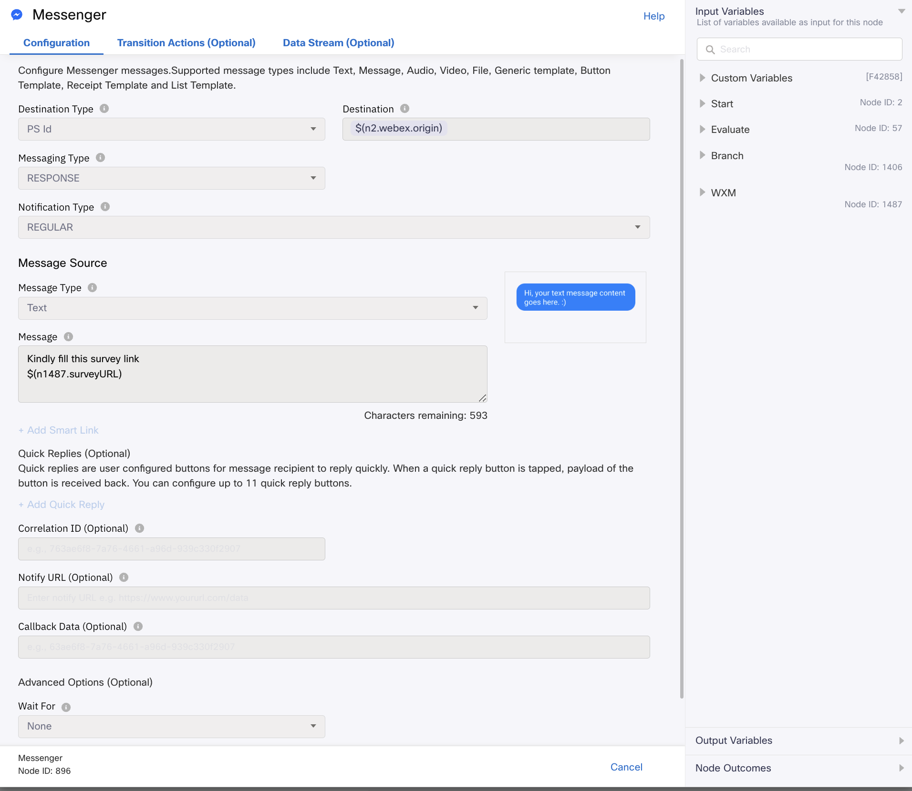 

- In the append conversation node, provide the same survey message and survey link.

 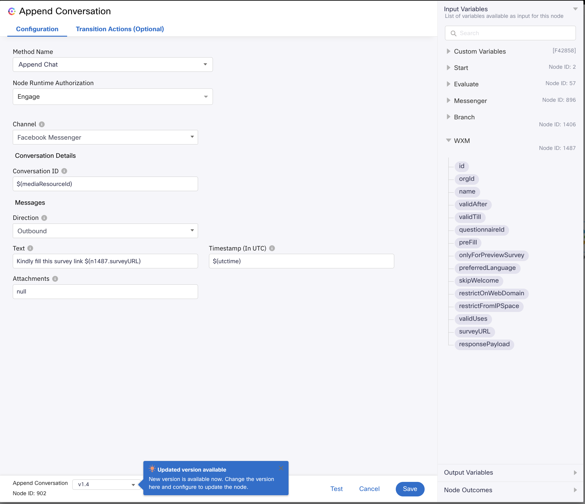 

- Example of the survey presented to the customer on the messenger.

 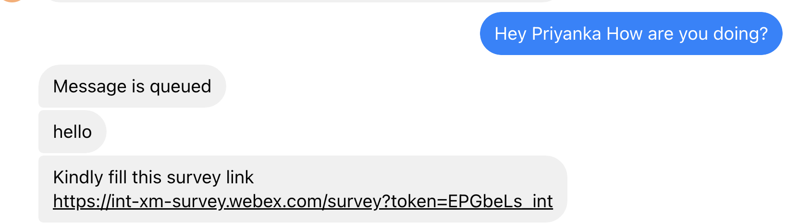 

### LiveChat Close Flow With Wxm Node

 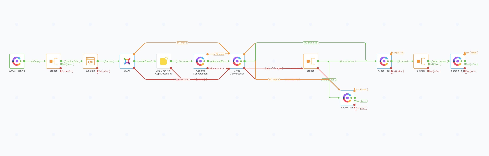 

- This flow allows the flow admin to send the survey messages and survey links to the customer over chat widget once the agent wraps up the conversation.

- Extract the thread and user in the evaluate node of the LiveChatClose flow.
In the subsequent node (LiveChat/InAppMessaging), both thread and user identifiers are necessary for sending survey messages and links to the customer.

 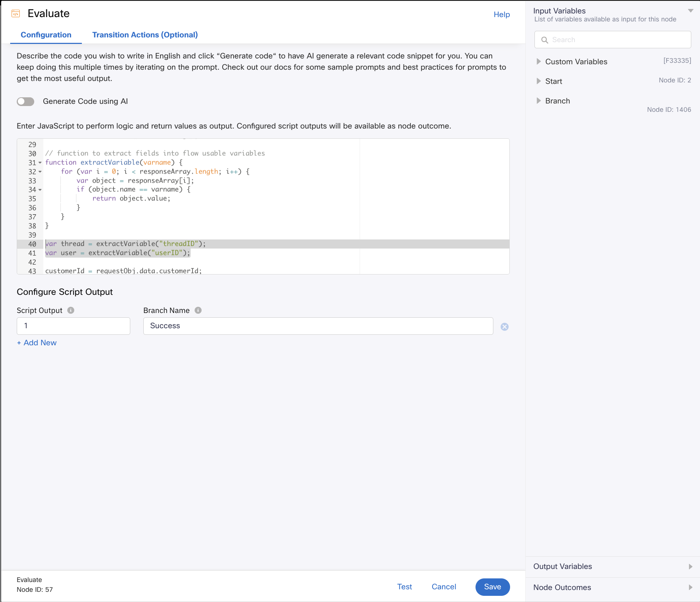 

- Set up the Wxm node.
- In the Live Chat / In-App Messaging node, provide survey message and pick the survey link from the previous node as `$(n1487.surveyURL)`. Also provide the `$(user)` and `$(thread)` in Destination and ThreadID field respectively. 

 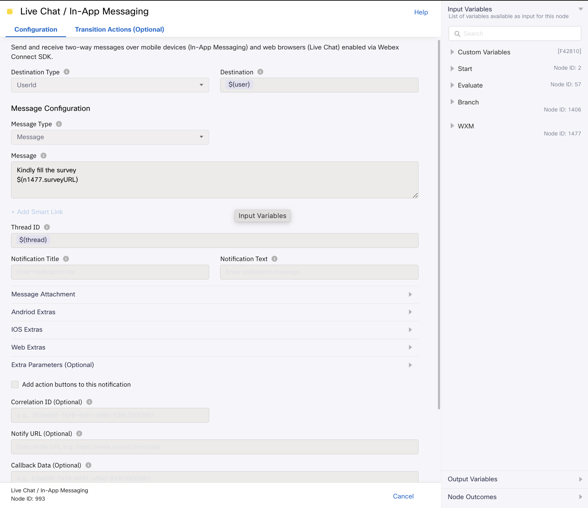 

- In the append conversation node, provide the same survey message and survey link.

 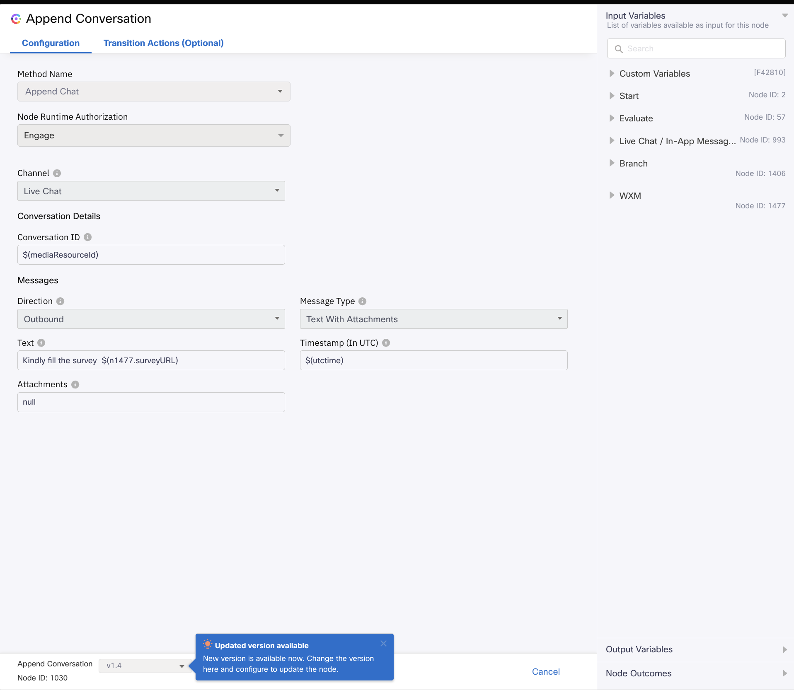 

- Example of the survey presented to the customer on the live chat widget.

 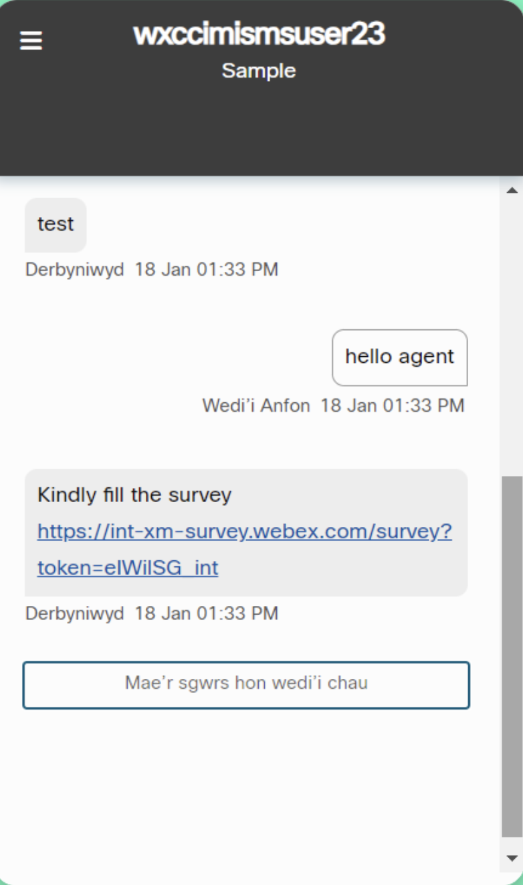 