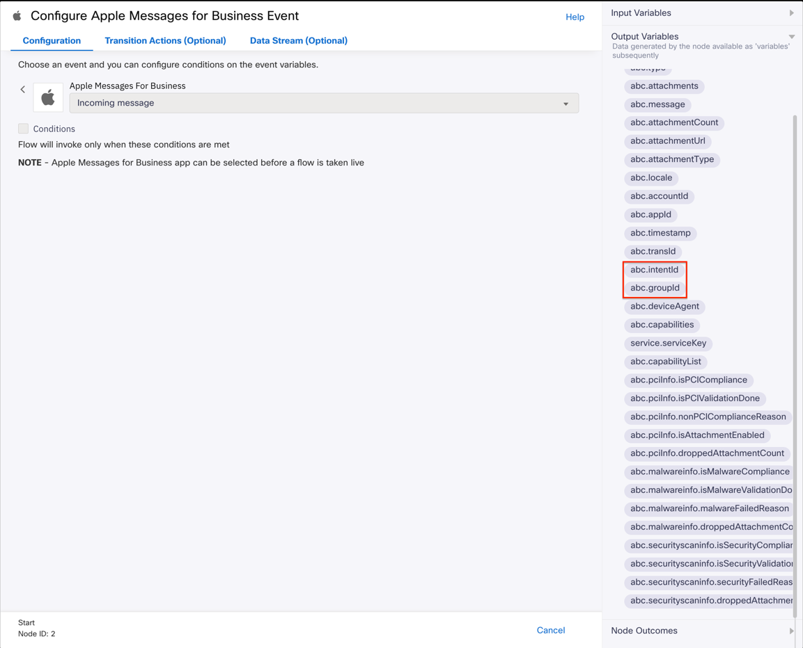

# Overview of Sample Flows

## Sample flow for IntentId and GroupId based routing
- This flow serves as a sample if the business needs to route new conversations using intentID and groupID values from an entrypoint
- The intentID and groupID are available as output variables of the start node, and can be used as needed by the flow designer to handle the contact further
  
- In the sample flow provided, as an example, these values are used to determine the queue to which the contact needs to be routed
- For further information about this feature, refer to Apple's documentation [here](https://register.apple.com/resources/messages/messaging-documentation/message-with-customers.md#about-intent-group-and-body-values)
