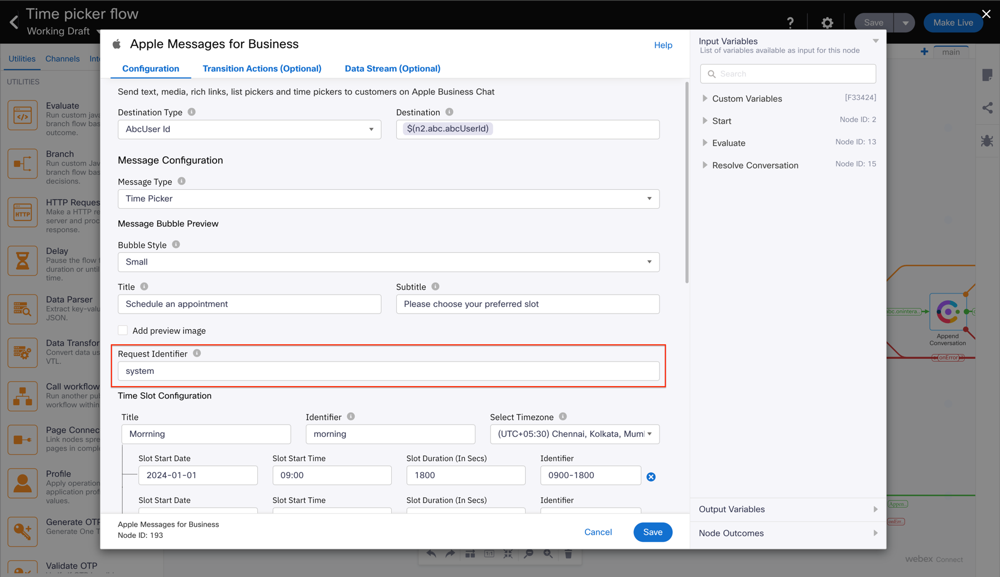

# Overview of Rich Messages supported

- The flows enclosed in this folder serve as templates for the below supported Rich Message features from flow to the customer:
  - Time picker
  - List picker
- These flows can be used as reference to send out rich messages to the customer for automated / bot scenarios.
- Ensure that the `request identifier` field is set to a static string, such as `system`, if rich message response flows are also made live.
  - 
  - Refer to the README in Rich Message Response Flows to understand how to use the request identifier set here.
- Further details about each of these rich message features can be found on Apple's documentation
- https://register.apple.com/resources/messages/messaging-documentation/customer-journey#interactive-features

