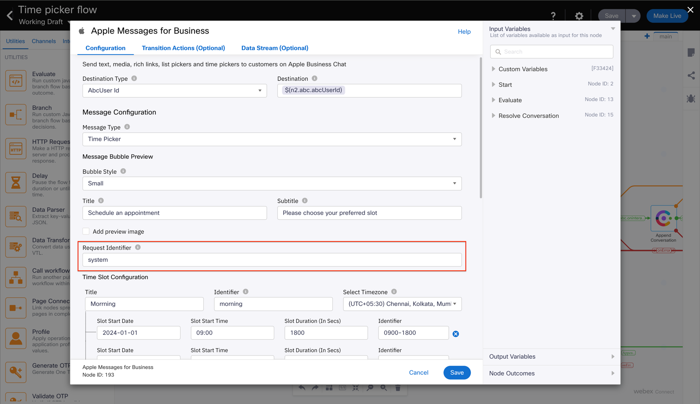

# Overview of Rich Message responses supported

- The flows enclosed in this folder serve as templates for the below supported Rich Message responses sent by the customer to the business:
    - Time picker response
    - List picker response
    - Form response
    - iMessage App 
- These flows are required only if the business needs to support use cases where the agent sends out rich messages, to which the customer responds.
  - If only responses to rich messages sent by flows need to be handled, these flows need not be imported. 
- For proper functioning of these flows, follow the below steps:
  - 
  - Any rich messages sent out via flows need to set the request identifier to a static string, say `system`
    - 
  - All flows in this folder, i.e. rich message response flows need to have an invocation condition set up in the start node to ensure that they get triggered only when the request identifier is not `system`. This will ensure that these flows get executed only when the customers respond to rich messages sent out by the agent.
  - If there are no rich messages sent out by flows, the invocation condition need not be set.
- Further details about each of these features can be found on Apple's documentation
    - https://register.apple.com/resources/messages/messaging-documentation/customer-journey#interactive-features