# Event Handling Workflows

## Workflows Overview
These flows are optional unless flow admin needs to build custom logic like displaying a Screen pop on the Agent's desktop etc. on occurrence of certain events. With v3.0 flows there will be default handling for all the events like
adding participant, removing participant, closing the conversation etc. If flow admin needs any alternative handling or additional business logic then these flows can be imported and customized as per the requirement.
These event handling flows are media channel agnostic and if different handling is required for channels or assets, then one can deploy as many flows as per the use case.

### Routed Event flow
* This workflow will be triggered when an agent is successfully assigned to a contact. The event for this workflow is 'Task Routed'. So once the contact has been routed to the agent and the agent has successfully accepted the contact, this workflow will be triggered.

#### When do you need Routed Event Flow ?

* Routed event flow is an optional flow. It is needed only when you want to do some customization like screen pop or http calls once the agent has successfully accepted the contact.

#### Start Node of Routed Event Flow

 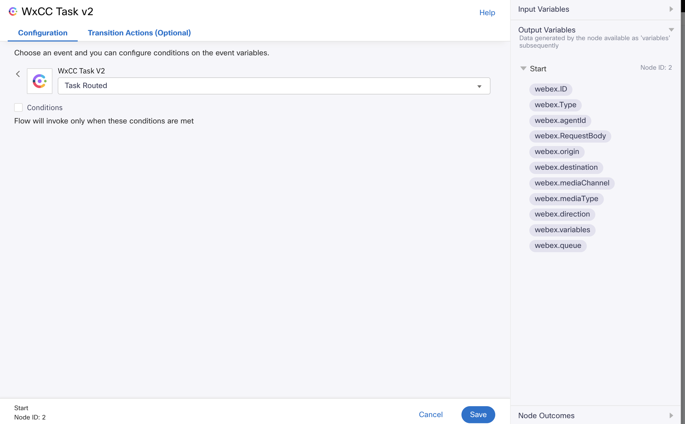 

Under the configuration section , we can see the event selected is Task Routed so this flow will be triggered on the Task Routed event. We can use the available variables from the
output variables section.

If you want to run the Routed Event flow only for specific assets or channels, you need to enable the conditions checkbox and add condition to the "WxCC Task V2" Node.
For adding conditions please refer to the [Adding Conditions In Flow](#adding-conditions-in-flow) section.

There is no restriction on the number of Routed Event Flows. You can add as many Routed Event Flows you need if different handling is required for each channel or asset.
But in this case you need to specify condition for each flow.

As webex.variables and webex.RequestBody are nested variables , we are assigning these to response and requestBody respectively so that we can use them further.

  

### Modified Event flow

* This workflow will be triggered when an agent has performed a conversation transfer or a conference. The event for this workflow is 'Task Modified'. So once the contact has been transferred to another agent or the contact has been conferenced with another agent, this workflow will be triggered.

#### When do you need Modified Event Flow ?
* Modified event flow is an optional flow. It is needed only when you want to do some customization like Screen Pop or http calls after the contact has been transferred or conferenced.

#### Start Node of Modified Event Flow

 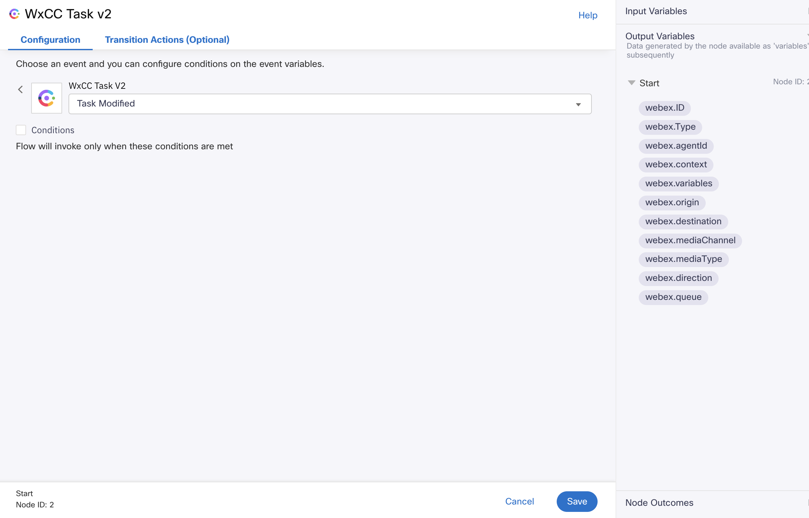 

Under the configuration section , we can see the event selected is Task Modified so this flow will be triggered on the Task Modified event. We can use the available variables from the
output variables section.

If you want to run the Modified Event flow only for specific assets or channels, you need to enable the conditions checkbox and add condition to the "WxCC Task V2" Node.
For enabling conditions please refer to the [Adding Conditions In Flow](#adding-conditions-in-flow) section.

There is no restriction on the number of Modified Event Flows. You can add as many Modified Event Flows you need if different handling is required for each channel or asset.
But in this case you need to specify condition for each flow.

As webex.variables and webex.RequestBody are nested variables , we are assigning these to response and requestBody respectively so that we can use them further.

  

##### Branch node

 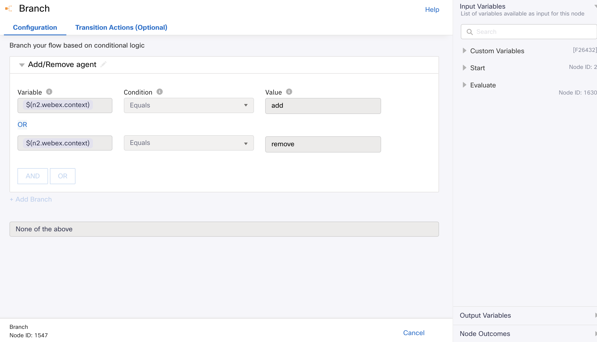 

In the branch node, condition is being checked for "webex.context". Context variable specifies if an agent/participant is added or removed from the contact.
In this sample screen pop is shown if the "webex.context" is one of "add" or "remove".

### Closed Event flow

* This workflow will be triggered when an agent or system has ended a contact and the conversation is closed. The event for this workflow is 'Task Closed'. So once the contact has been closed
then this workflow will be triggered.

#### When do you need Closed Event Flow ?
* Closed event flow is an optional flow. It is needed only when you want to do some customization like Screen Pop or http calls when the contact has been ended.

#### Start Node of Closed Event Flow

 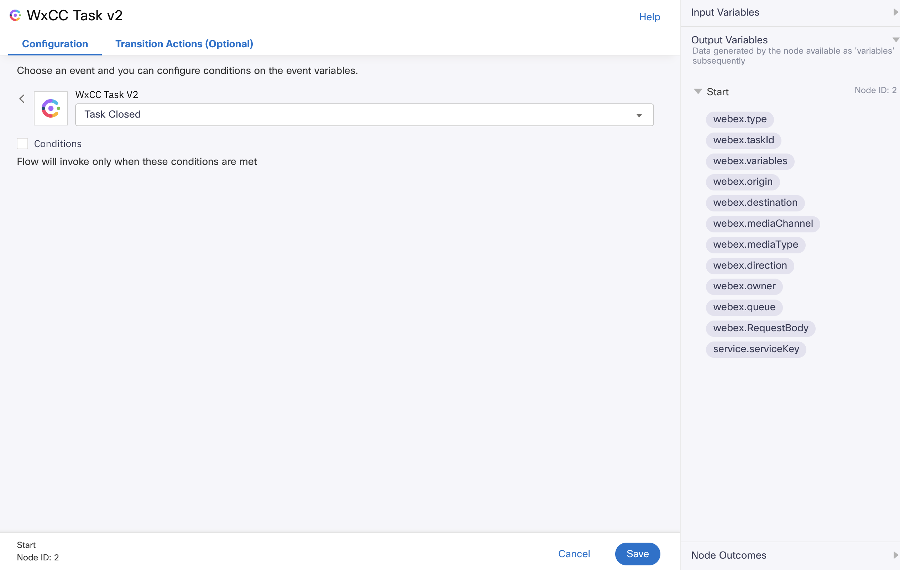 

Under the configuration section , we can see the event selected is Task Closed so this flow will be triggered on the Task Closed event. We can use the available variables from the
output variables section.

If you want to run the Closed Event flow to run only for specific asset then we need to enable the conditions checkbox and add condition to the "WxCC Task V2" Node.
For enabling conditions please refer to the [Adding Conditions In Flow](#adding-conditions-in-flow) section.

There is no restriction on the number of Closed Event Flow. You can add as many Closed Event Flow you need if different handling is required for each channel or asset.
But in this case you need to specify condition for each flow.

As webex.variables and webex.RequestBody are nested variables , we are assigning these to response and requestBody respectively so that we can use them further.

  

##### These event flows are applicable for all channels by default. If v2.x shared flows are already available in the same org, refer to the [Migration Strategy](#migration-strategy) section .

## Adding Conditions In Flow
If you want your flow to be triggered only if the specified conditions are met then it can be achieved by adding conditions.
You can choose any condition or a set of conditions out of conditions shown in the dropdown of the below image based on your usecase.

 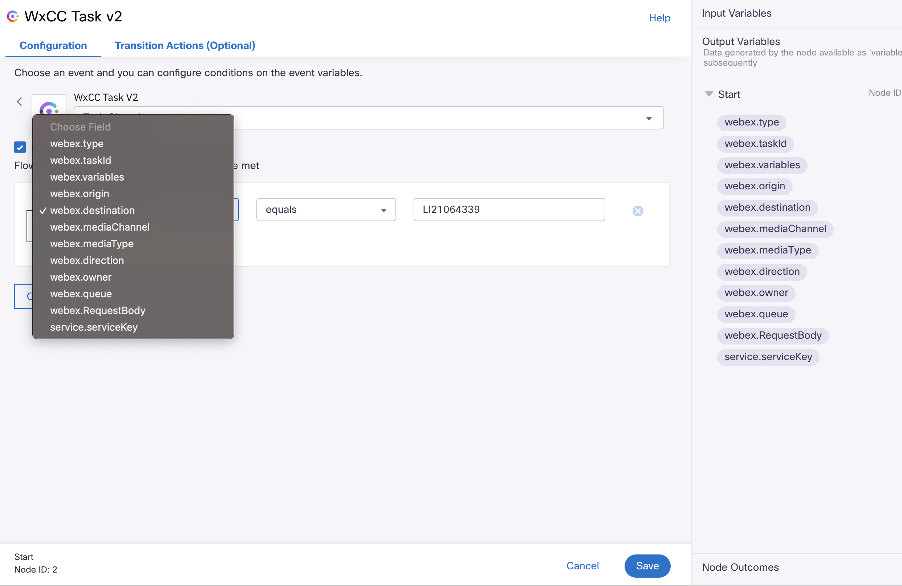 

### Examples of adding conditions in Flow.
1. If you want to run a flow only for a particular channel let's say LiveChat, then you can specify condition like "webex.mediaChannel" equals "web".

2. If you want to run a flow only for some specific asset then we can use  the "webex.destination" field which will help us to determine the asset.

Values of "webex.destination" for different channels: -
* LiveChat :- App ID
* Whatsapp :- App ID
* Facebook :- App ID
* Email :- App ID
* SMS :- Service Number

The App ID  of a particular asset can be obtained from the assets→apps page in Webex Connect portal.

 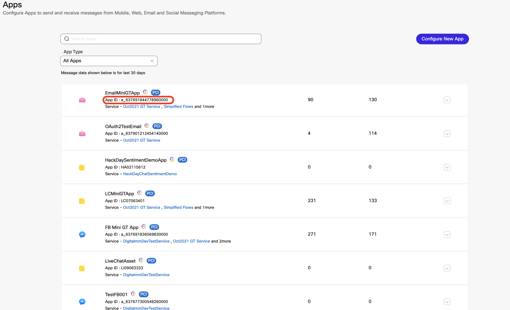 

The Service Number of a particular sms asset can be obtained from the assets→Numbers page in Webex Connect portal.

 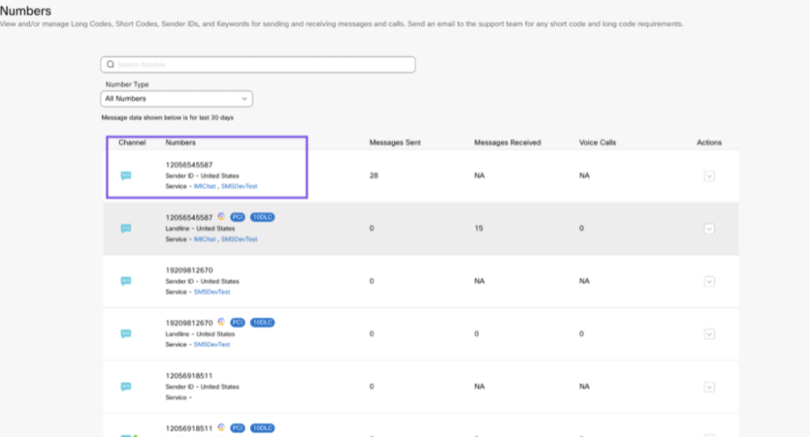 

If we want to run the flow for multiple assets then additional new "equals" condition must be added with the OR operator.

 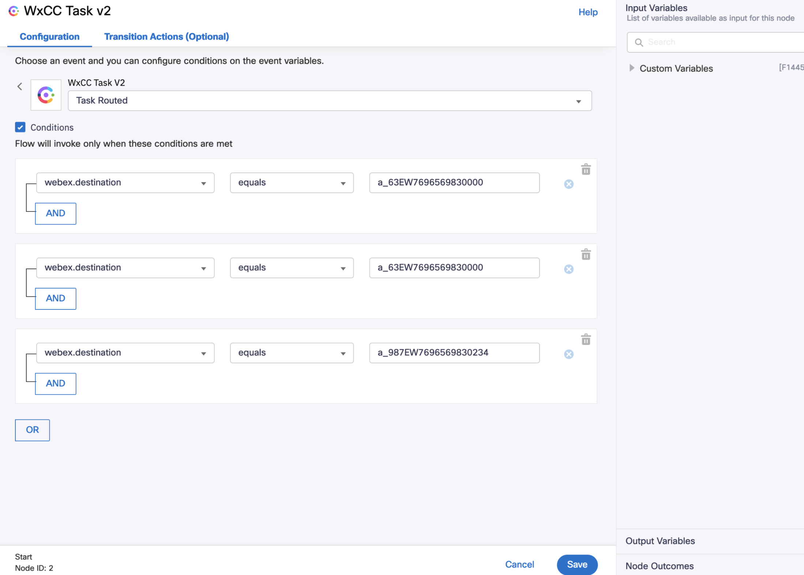 

If we don't want to run the flow for a specific asset then we can use "notequals" condition.

 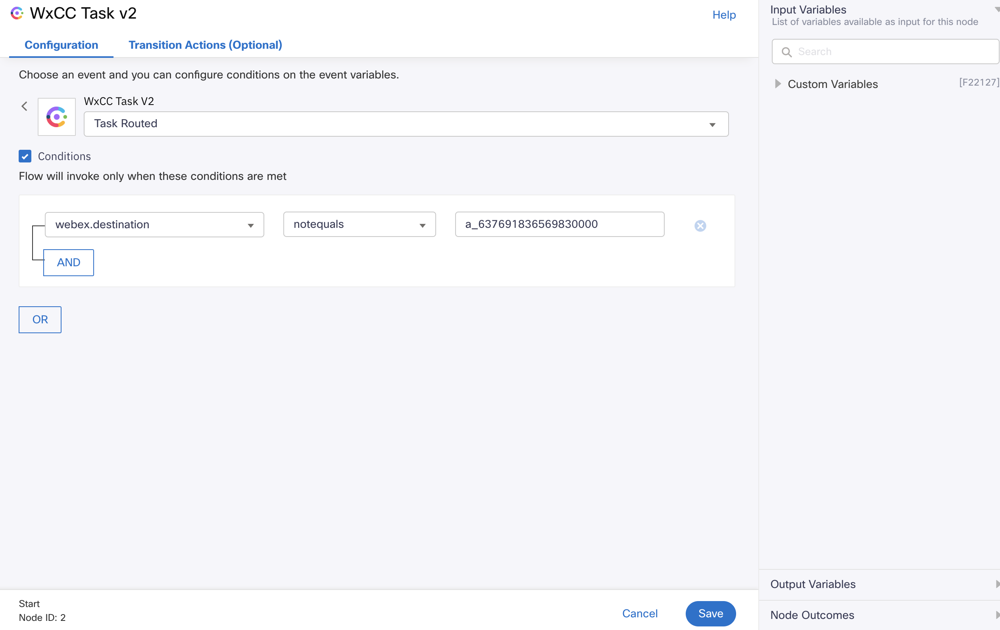 

If we don't want to the run the flow for multiple assets then additional "notequals" condition must be added with the AND operator.

 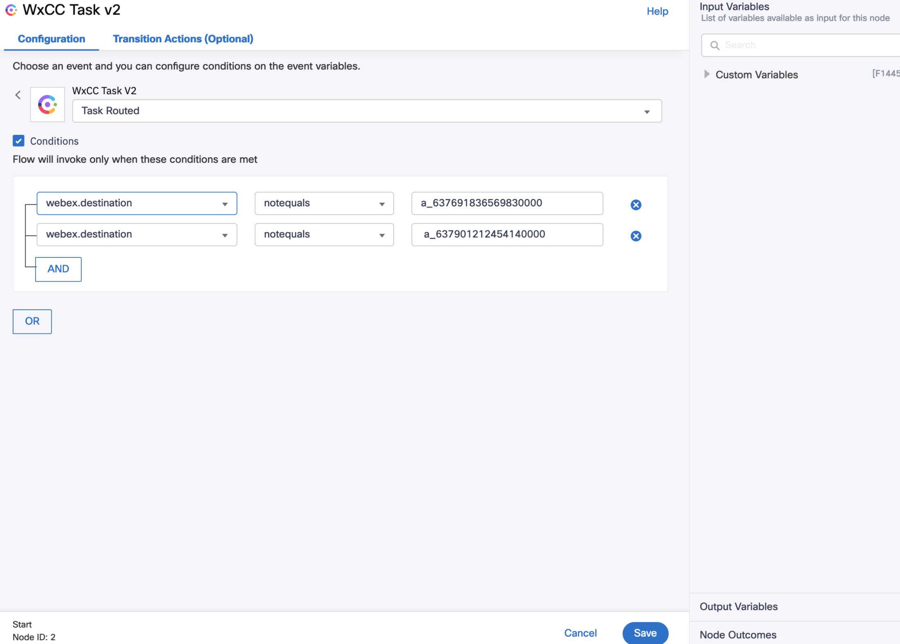 

For more details on adding conditions please refer https://help.imiconnect.io/docs/start-node#trigger-conditions-in-start-node

### Using variables or details in event flows

Evaluate node in the Event Handling Workflows is extracting variables from request Json.
In the Evaluate node all predefined system variables are defined and assigned.

 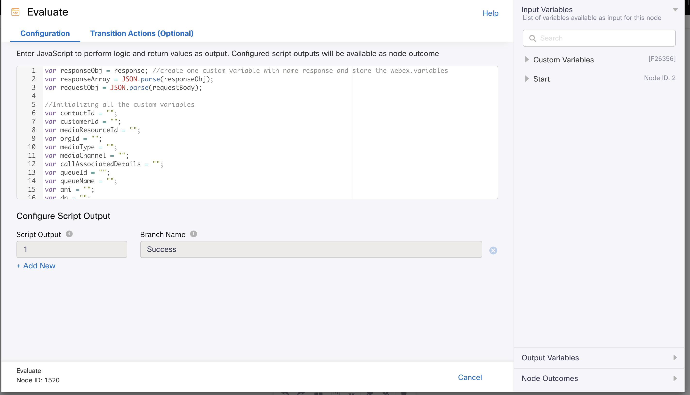 

Helper method is also provided in the Evaluate node, to extract flow and global variables which are set in the main flows via set variable node.

  

Note : Predefined System Variables and Extracted variables can be used to do any custom logic like screen pop or http calls.
Please Refer to [Screen Pop Readme](../../Sample/Usage%20of%20Screen%20Pop%20in%20Flows/README.md)
All the sample event flows demonstrate screen pop usage though they can be used for building other custom logic also.

## Migration Strategy
* Flow admins can manually migrate the existing main flows for each asset to V3.0 at their pace.
* The shared flows can be manually migrated to the V3.0 versions only when all the main flows for each asset are migrated already.
* If the org has migrated only a few of their main flows to V3.0, shared V2.x flows should have the condition to prevent running for contacts created via V3.0 flows. Similarly, V3.0 shared flows should have the condition to run only for the assets migrated to V3.0.
* For migration, refer to the steps mentioned in 
  [Migration Strategy](../Migration-Strategy.pdf)
