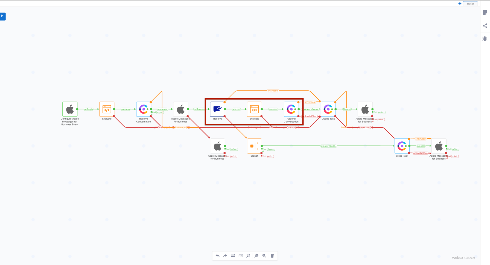
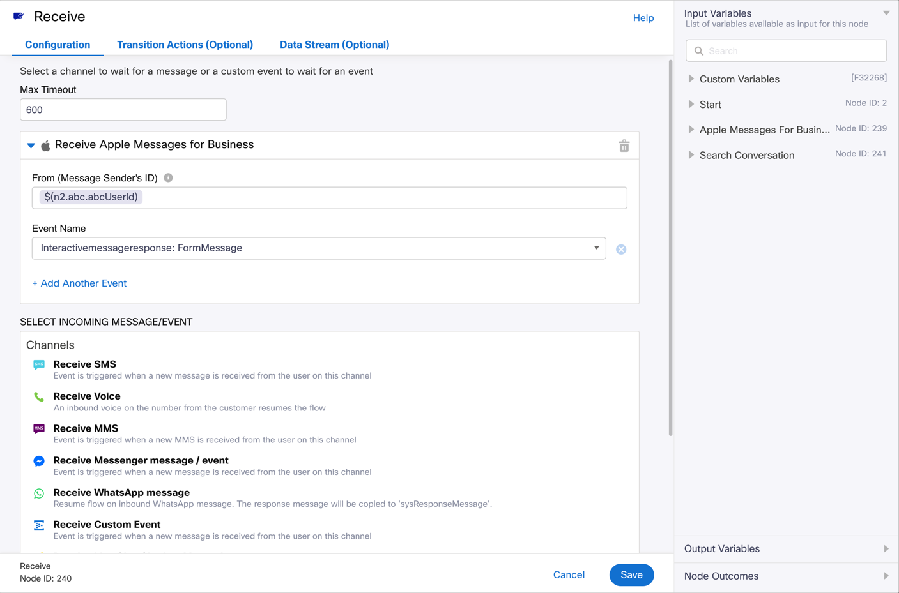
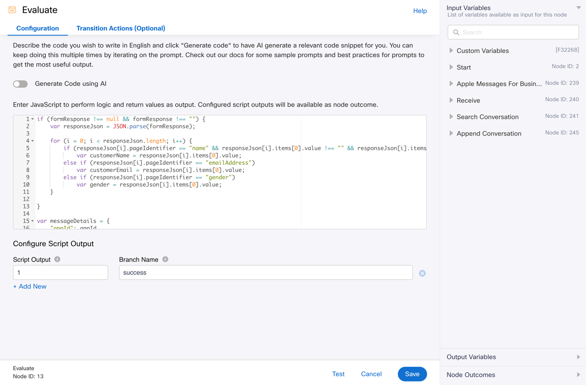
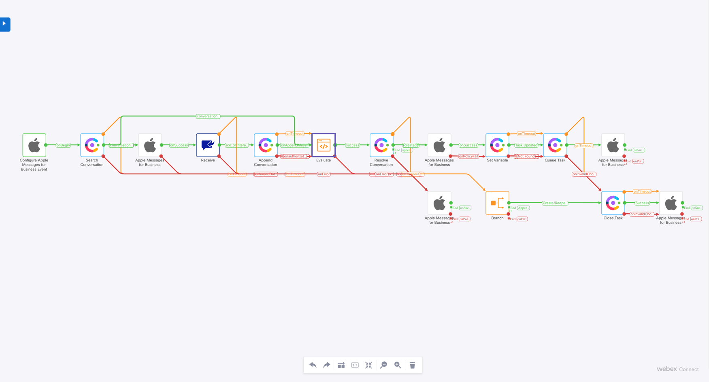
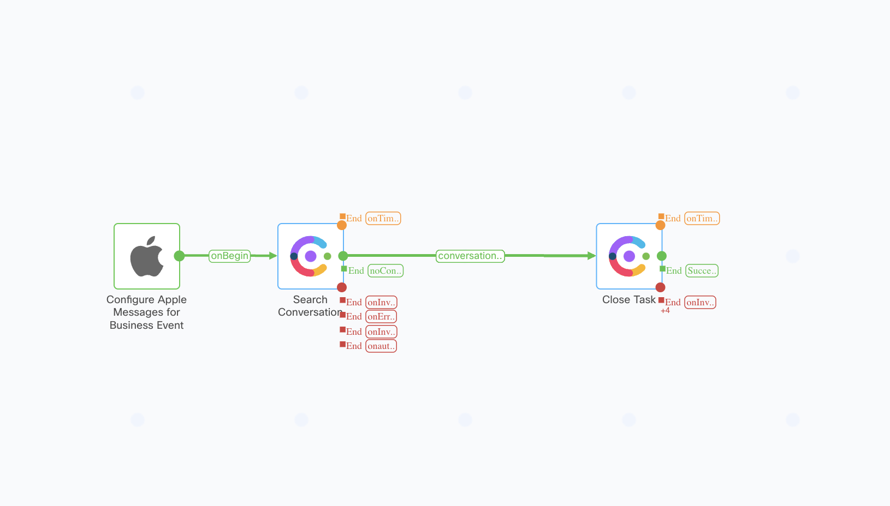

# Overview of Apple Messages for Business template flows

- This document covers the purpose and configuration details for the below template flows for Apple channel
  - Basic Inbound flow 
  - Inbound flow with form
  - Unsubscribe flow

## Overview of Apple Messages for Business inbound flow

- This workflow will be triggered for every inbound customer message from the Apple Messages app.
- In addition to basic steps such as resolving a conversation and queuing it, this flow also has logic required to receive a message from the customer via a Receive node, process the attachments via an Evaluate node, and append it to the conversation via an Append Conversation node
    - 
    - This can be repeated wherever such a need arises, to accept messages from the customer via a Receive node in between a flow instead of a Start node at the beginning of a flow, and then to append it to the conversation
    - The Receive, Evaluate and Append Nodes described here and in the screenshot above can be removed if not needed as they are optional.

## Overview of Apple Messages for Business inbound flow with form

- This workflow will be triggered for every inbound customer message from the Apple Messages app.
- The customer will be presented with a form asking for some basic details.
- The fields in the form can be reconfigured by the flow admin as per their requirements.
- The fields obtained from the form are extracted by using the Evaluate node and then made available to the agent by setting global/flow variables, using the Set Variable node.
- Forms are supported only on iPhones and iPads by Apple, Mac devices do not have support.
  - https://register.apple.com/resources/messages/msp-rest-api/type-interactive#form-message
- Note: The chat widget on the agent's desktop will show the customer's name as supplied (via form) the first time a message was sent from that customer to the business's asset.
  - If the customer's name is unavailable the first time the customer messages the asset, fallback name can be updated in the flows by updating the `defaultCustomerName` variable.
  - If `defaultCustomerName` is not available or empty, a substring of the customer's userId will be used in its place.

### Configuring the Apple Messages for Business flow with a form

#### Step 1: Setting up the form in the Apple Messages for Business node

- Choose the message type as "Form Message"
- In the form elements field, supply the json for the form configuration
- In the sample flow, name, defectiveProduct and email address are the fields presented in the form.
- The fields in the form can be reconfigured by the flow admin as per their requirements, using [this documentation](https://register.apple.com/resources/messages/msp-rest-api/type-interactive#form-message) for reference.
- Using the sample payload in the flow and in the above documentation, one can prepare the JSON according to their needs and supply it in the node.
- Other optional fields in the node can be configured if needed.

#### Step 2: Receiving the form response via the Receive node


- Set a reasonable timeout for the node based on how long one might take to fill the form configured
- Select "Receive Apple Messages for Business" as the event
- Configure the "From" field as ```$(<startNodeId>.abc.abcUserId)```
- Select the "Event name" as "Interactivemessageresponse: FormMessage"

#### Step 3: Adding the form response to the conversation history using the Append Conversation node

- In the Append Conversation node, select "Single Message"
- Select "Message Type" as "AMB Form Response"
- Set "Form response" as $(<receiveNodeId>.receive.payload)
- Set "Timestamp" as ```$(<receiveNodeId>.abc.timestamp)```

#### Step 4: Extracting the values in the form via the Evaluate Node


- In this sample flow, the 3 fields presented in the form are being extracted in the Evaluate node with the below script. Similar script can be developed to extract any other fields configured by the flow admin
- Add the below lines to the beginning of the script:
    ```
    if (formResponse !== null && formResponse !== "") {
        var responseJson = JSON.parse(formResponse);

        for (i = 0; i < responseJson.length; i++) {
            if (responseJson[i].pageIdentifier == "name" && responseJson[i].items[0].value !== "" && responseJson[i].items[0].value !== null)
                var customerName = responseJson[i].items[0].value;
            else if (responseJson[i].pageIdentifier == "emailAddress" && responseJson[i].items[0].value !== "" && responseJson[i].items[0].value !== null)
                var customerEmail = responseJson[i].items[0].value;
            else if (responseJson[i].pageIdentifier == "defectiveProduct")
                var defectiveProduct = responseJson[i].items[0].value;
        }
    }
    ```

#### Further steps


- Rest of the flow continues as usual, Resolving the conversation, Queuing the task and so on
- Optionally, the flow admin can choose to set variables for the fields extracted from the form and make them visible to / editable by the agent, using the Set Variable node. For further details on how to use this node, refer here - Webex Connect Flows/Sample/Usage of Set Variable In Flows/README.md
- Note: If the customer name is made available through the form, the contact origin will be set as the name itself. This will be visible on the Agent's desktop and in reports as well. If the customer's name is not available, the userId will be used as the origin.

## Overview of Apple Messages for Business unsubscribe flow



- This workflow will be triggered whenever a customer unsubscribes from the business's messages.
- This flow takes care of closing the task associated with the conversation.
- Once the customer has chosen to unsubscribe, the business cannot send messages to the customer via the agent or the flow until the customer messages the business.
