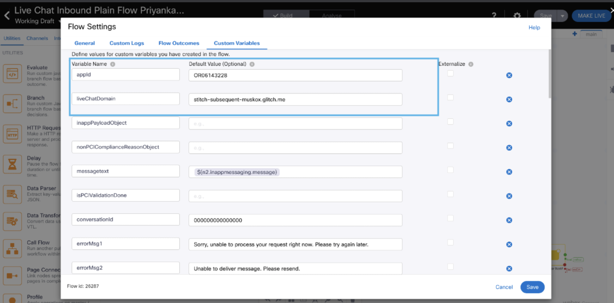
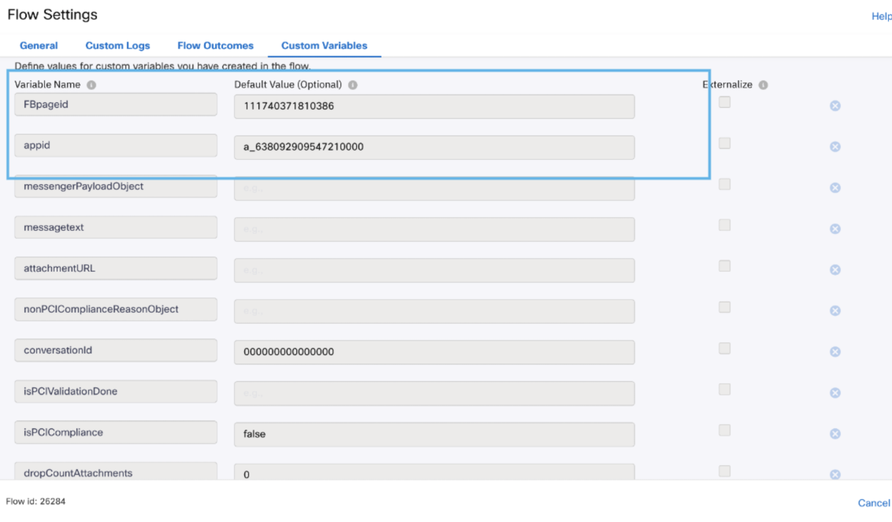

# Media Specific Workflows

## Workflows Overview
The following workflow templates are included :

**Media Specific Workflows** : These flows need to be imported once per asset of the specific channel.
* **Facebook Inbound Flow** - This workflow will be triggered for every inbound customer message received over the integrated Facebook page.
* **Live Chat Inbound Flow** - This workflow will be triggered for every inbound customer message received over the configured customer chat widget, and the widget has a live chat form configured.
* **Live Chat Inbound Flow Without Form** - This workflow will be triggered for every inbound customer message received over the configured customer chat widget and the widget doesn't have a live chat form configured.
* **SMS Inbound Flow** - This workflow will be triggered for every inbound customer sms received over the integrated SMS phone number.
* **Email Inbound Flow** - This workflow will be triggered for every inbound customer email received on the integrated email account.
* **Whatsapp Inbound Flow** - This workflow will be triggered for every inbound customer message received over the integrated whatsapp business number.
* **Apple Messages For Business Inbound Flow** - This workflow will be triggered for every inbound customer message over the integrated business account.
* **Live Chat Close Flow** - This workflow will be triggered when a livechat customer has ended the chat.

Note :
- Queue selection from queue task node is mandatory for any channel flows before making the flow live.
- Flow variables must be updated in the setting section with the correct asset details before making the flow live.

## Updating Flow Variables

Flow Variables that need to be updated under Custom Variables for different channels: -
- LiveChat :- appId and liveChatDomain
  

- Facebook :- FBpageid and appid
  

- Whatsapp :- WANumber and appid

  

- Email    :- bizemailid

  

## How to setup Workflows?

* Follow the process for Organization setup in WxCC with IMI Integration.
* Download the sample flow template from the repository.
* Import the flows in your Webex Connect service.
* Add authorizations at integration level.
* For Resolve Conversation node flow id needs to be updated manually. Flow id can be obtained from the address bar. For example flow id (41896) can be obtained from the url https://testorg.datacenter.webexconnect.io/flowdesigner/flow/v3/flowView?flowId=41896
* Modify the flows as per your use case.
* Make flows live with the configured assets.

Details of this material is available in Webex Connect platform documentation.
* Login to your Webex Connect account.
* Click `Documentation` under `Help` section.
* Click on `Documentation` under `Help` section.
* Webex Connect platform documentation will open in a new tab.
* Webex Connect platform documentation will open in a new tab.
* Under `Getting Started`, click `Webex Connect Platform Overview`.
* Under `GETTING STARTED` click on `Webex Connect Platform Overview`.
* Scroll down to the `Webex Contact Center and Webex Connect Integration` section.
* Scroll down to `CISCO WEBEX CONTACT CENTER AND Webex CONNECT INTEGRATION` section.
* Click `Overview`.
