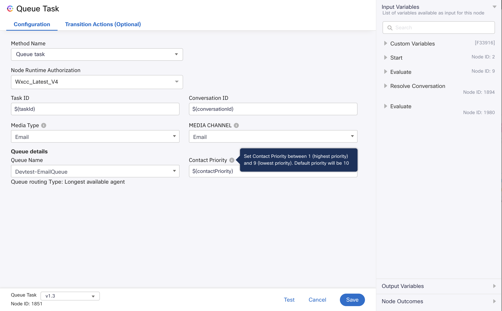
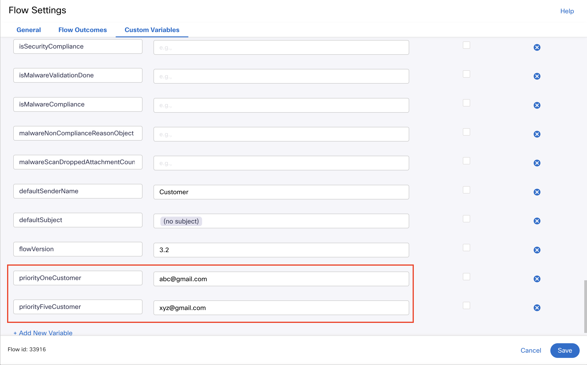
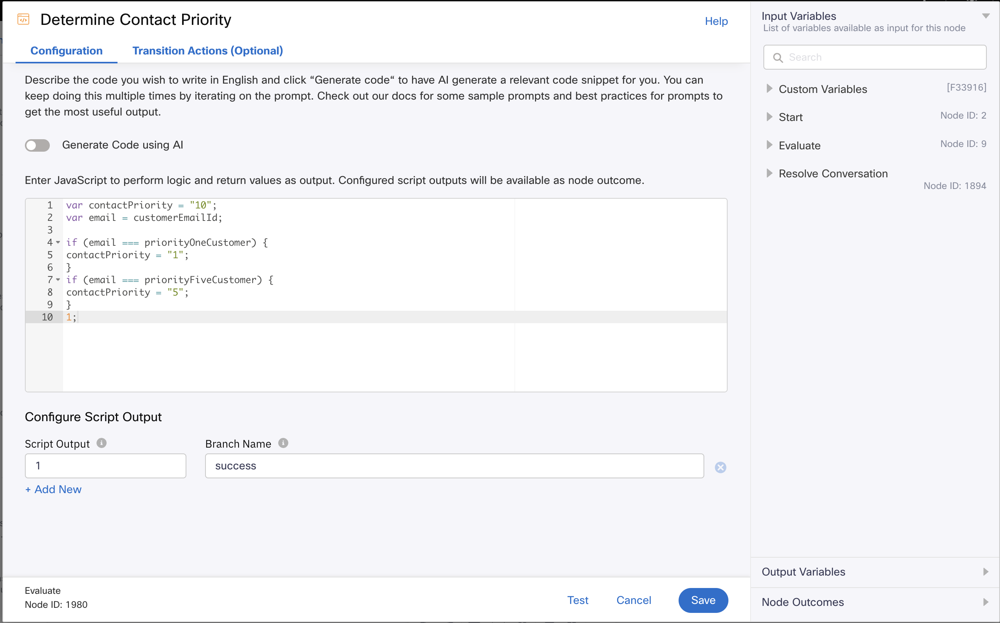

# Contact Priority Sample Flows Overview :
- Contact Priority feature allows contacts to be prioritized over other contacts in the queue.
- Contact Priority can only be set while queuing a contact using Queue Task node and cannot be changed once the contact is queued.
- If Contact Priority is enabled for some but not all contacts, there is a risk that those without an assigned priority will never move to the top of the queue.
- Custom logic must be built to determine contact priority in the media specific inbound flows. 
- Building custom logic is not in the scope of this document as it can vary from business to business. 
- This example demonstrates how to set the contact priority in the Queue Task node in the media specific inbound flows for Email Channel. However, the feature is applicable to all digital channels alike. 
- For more details, refer to - https://help.imiconnect.io/docs/queue-task 

# Queue Task Node:
- Queue task node consists of the "Contact Priority" field.
- Enter priority in the Contact Priority field if you want to assign a priority to queued contacts.
- 1 is the highest priority, while 9 is the lowest priority. Any level between 1 and 9 takes precedence over a contact with no priority configured.
- By default, this field is empty and contacts will be queued without any priority. (Default priority assumed by system is 10)
 
    

- Contact Routing Behaviour - 
  - The highest priority contact across all queues (of a media channel) is assigned to the next available agent who is:
    - Logged in to a team that is in the current call distribution group of the contact.
    - Eligible to pick this contact based on the routing algorithm.
  - The contacts are handled as follows:
    - If no priority is assigned to the contact, then the default priority is 10.
    - Contacts with higher priority are handled first. 
    - If two contacts have the same priority, then the contact waiting in the queue for the longest duration is handled first.

- Possible field values - 
  - Static Priority - 
    - The Contact Priority field can be set to a static integer value. (between 1 and 9)
    - Set the static integer priority value if you want to assign a priority before publishing the flow.
  - Variable Priority - 
    - The Contact Priority field can be set to a variable that evaluates to an integer during flow execution. (between 1 and 9)
    - Set the variable integer priority value if the contact priority should change dynamically with each flow execution.
    - If the evaluated priority isn’t in the range 1–9, then the default priority is 10. (equivalent to no priority)
  - No Priority - 
    - The Contact Priority field can be left empty if you don't want to assign a priority to the contact.
    - The default priority is 10. (equivalent to no priority)

## Email Inbound Sample Flow With Contact Priority
- This sample flow builds a simple custom logic to determine priority based on email ID of the incoming customer. 
- The evaluated priority is set in the Queue Task node. 
- Custom variables are created under flow variables to define a high and low priority customer. 

     

- The custom logic is built using the Evaluate node using the defined flow variables. 

    

- The evaluated priority is set in the Queue Task node.