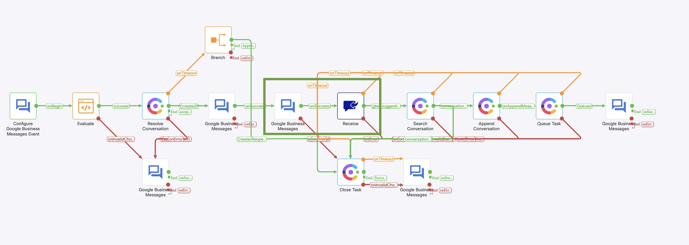

# Overview of Google Business Messages template flows

- This document covers the purpose and configuration details for the below template flows for Google Business Messages channel
  - Basic Inbound flow
  - Inbound flow with suggestions

## Overview of Google Business Messages Inbound flow

- This workflow will be triggered for every inbound customer message from the Google Business Messages Asset.
- You can Asset Creation : https://help.imiconnect.io/docs/google-business-messages
- This flow contains the basic steps to resolve a conversation and queuing it, when a message is received on the Google Business Messages Asset 
  - 
  - Google Business Messages nodes allows you to send Text Messages, Images, Rich Cards, and Carousel Cards to your end customers.
## Inbound flow with suggestions

- This workflow will be triggered for every inbound customer message from the Google Business Messages Asset.
- When a message is received on the Google Business Messages Asset the flow will offer a few text suggestions on the type of service offered and get the customer response before queuing the contact to live agent for further deliberation
- 
- Google Business Messages nodes allows you to send Text Messages, Images, Rich Cards, and Carousel Cards to your end customers. Alongside these message types, you can also add suggestions, which are pre-configured replies or actions that the customer can send back or perform in response to your message.
- To read suggestion responses from customer utilize a Receive Node in below fashion, the output variable section will have the customer response
    - 
- The highlighted portion for the flow can be used repeatedly from the flow in self-service mode to offer multiple suggestions to customer / add branching logic on the flow.
- 
## GBM Specific Variables

#### To be Noted 
- In the first phase of GBM integration with WxCC only `Incoming Message` is supported from the GBM start node 
  - 
- The gbm.conversationId variables from gbm specific nodes are different from the conversationId variable from Search Conversation response and cannot be used interchangeably

#### Further Readings
- You can explore more information on flow nodes and other api in the below links from connect documentation
  - Google Business Messages Node: https://help.imiconnect.io/docs/google-business-messages-1
  - Google Business Messages FAQ : https://developers.imiconnect.io/reference/google-business-messages