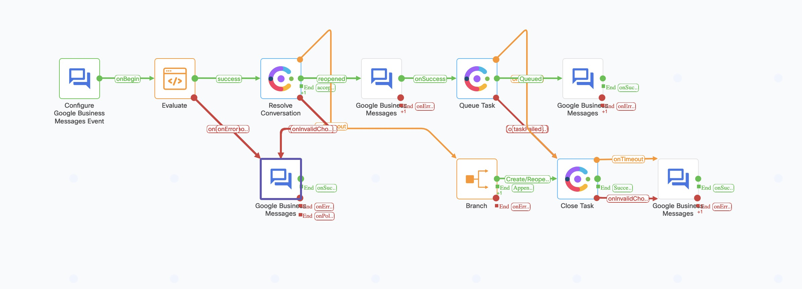

# Overview of Google Business Messages template flows

- This document covers the purpose and configuration details for the below template flows for Google Business Messages channel
  - Basic Inbound flow
  - Inbound flow with suggestions
- Inorder to publish the flows you will need assets configured for Google Business Messages channel you can find the documentation for asset configuration in https://help.imiconnect.io/docs/google-business-messages

## Overview of Google Business Messages Inbound flow

- This workflow will be triggered for every inbound customer message from the Google Business Messages Asset.
- This flow contains the basic steps to resolve a conversation and queuing it, when a message is received on the Google Business Messages Asset 
  - 
  - Google Business Messages can be used to send Text Messages, Images, Rich Cards, and Carousel Cards to your end customers.
## Inbound flow with suggestions

- This workflow will be triggered for every inbound customer message from the Google Business Messages Asset.
- When a message is received on the Google Business Messages Asset the flow will offer a few text suggestions on the type of service offered and get the customer response before queuing the contact to live agent for further deliberation
- 
- Google Business Messages nodes allows you to send Text Messages, Images, Rich Cards, and Carousel Cards to your end customers. Alongside these message types, you can also add suggestions, which are pre-configured replies or actions that the customer can send back or perform in response to your message.
- To read suggestion responses from customer utilize a Receive Node in below fashion, the output variable section will have the customer response
    - 
- The highlighted portion for the flow can be used repeatedly from the flow in self-service mode to offer multiple suggestions to customer / add branching logic on the flow.
- 
### GBM Flow Variables , a walk through
  - Some  gbm specific variables that are available from the start node/ receive node etc. are discussed below,this list is not exhaustive and more detailed documentation can be found in https://developers.google.com/business-communications/business-messages
  -
|Variable Name  | Usage/Descripton  |
| ------------- | ------------- |
| gbm.text  | Contains the incoming message from customer  |
| gbm.timestamp  | Time at  which message was sent   |
| gbm.conversationId  | Unique Identifier for a chat/conversation with one customer  |
| gbm.displayName  | Customer name as set in Google account  |
| gbm.agentId  | Unique Identifier for chat asset  |
| gbm.requestId  | Unique identifier of the message.  |
  - In the case `gbm.displayName` variable comes empty to the Resolve Node during processing customer name will be defaulted to the value of the flow variable `customerName`
   -

#### To be Noted 
- In the first phase of GBM integration with WxCC only `Incoming Message` is supported from the GBM start node 
  - 
- The gbm.conversationId variables from gbm specific nodes are different from the conversationId variable from Search Conversation response and cannot be used interchangeably
- For Resolve Conversation node flow id needs to be updated manually. Flow id can be obtained from the address bar. For example flow id (41896) can be obtained from the url https://testorg.datacenter.webexconnect.io/flowdesigner/flow/v3/flowView?flowId=41896

#### Further Readings
- You can explore more information on flow nodes and other api in the below links from connect documentation
  - Google Business Messages Node: https://help.imiconnect.io/docs/google-business-messages-1
  - Google Business Messages FAQ : https://developers.imiconnect.io/reference/google-business-messages